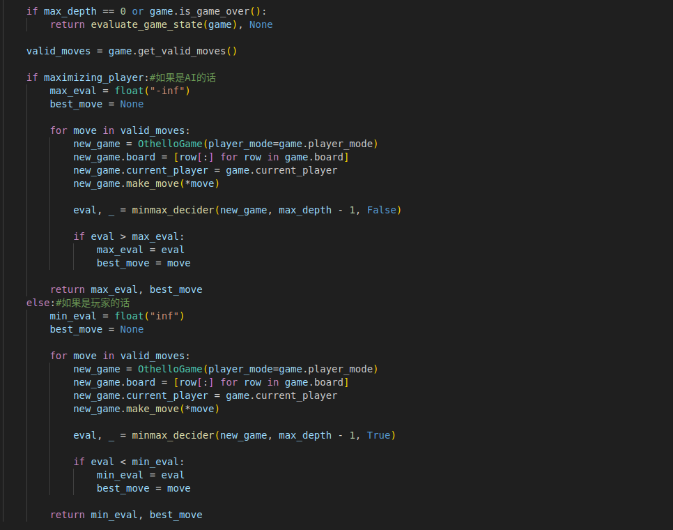
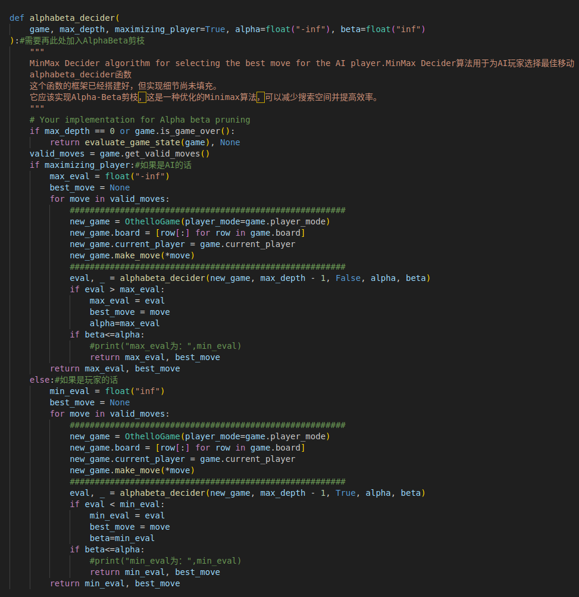
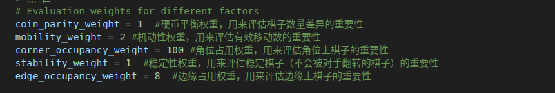
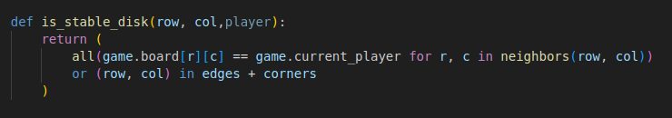
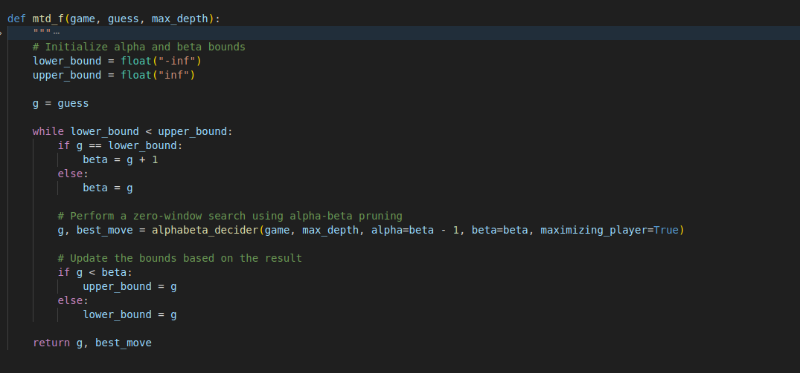

# Othello黑白棋游戏报告
## 231300027朱士杭 
## 一、理解并介绍MiniMax搜索的实现
MiniMax搜索算法用到了树形结构的搜索，并且使用了递归与深度优先的思想（在没有进行剪枝的情况下）

首先先介绍一下MiniMax搜索算法的大致思想与思路，
Minimax 算法又叫极小化极大算法，是一种找出失败的最大可能性中的最小值的算法，从而提升自己获胜的概率。我们假定对手和我们都是一样聪明的人，都是能够尽自己最大努力使得自己收益最大的情况下对方收益最小。常用于棋类等由两方较量的游戏和程序。该算法是一个零总和算法，即一方要在可选的选项中选择将其优势最大化的选择，另一方则选择令对手优势最小化的方法。而开始的时候总和为0。

在局面确定的双人对弈里，常进行对抗搜索，构建一棵每个节点都为一个确定状态的搜索树。奇数层为己方先手，偶数层为对方先手。搜索树上每个叶子节点都会被赋予一个估值，估值越大代表我方赢面越大。我方追求更大的赢面，而对方会设法降低我方的赢面，体现在搜索树上就是，奇数层节点（我方节点）总是会选择赢面最大的子节点状态，而偶数层（对方节点）总是会选择我方赢面最小的的子节点状态。

说的通俗一点就是有两个人下棋，先手希望下一步的局面是自己胜算最大的局面，而后手则希望下一步的局面是先手胜算最小的局面（因为先手输，后手就会赢）。

那么，如何来判断当前的局面的胜算到底怎么样呢？我们可以设置一个局面评估函数，按照某种方案来计算当前局面的优劣程度。

然后在这种想法的前提下，就是高能的博弈过程。如果只向后看一步（也就是直接计算下一步的估价值）的话，那情况就是：先手预测了自己走完这一步的所有可能的局面，然后选择了所有走法中局面看起来最好的（评估函数的结果最好的）走法。之后，后手也预测了自己走完这一步的所有可能的局面，然后也选择了所有走法中局面看起来最好的（评估函数的结果最好的）走法。如此循环往复，直到最后游戏结束。

如果这两个棋手比较优秀，可以往后看两步（也就是只直接计算往后数两步的估价值），那么，情况就是这样的：先手预测了自己走完这一步的所有可能局面，并同时预测了对手的所有应对方案（也就是对手会选择让下一步局面估价函数最小的走法，所以先手这一步应该选择，让后手不管走么走估价函数都尽量大的走法），综合这些信息，选择了一个最优的局面，后手也是如此。也就是我猜到了我这么走，你会怎么走，所以我选择这么走（我预判了你的预判）。

当然，也可以往后看三步（也就是只直接计算往后数三步的估价值），那么，情况就是这样的：先手预测了自己走完这一步的所有可能局面，并同时预测了对手的所有应对方案，还同时又想到了自己在面对对手的每种应对方案时的所有可能走法，从中选择一个最优秀的，后手也是如此。也就是，我猜到了我这么走，你会那么走，然后我会这么走，所以我选择这么走（我预判了你对我的预判）。

算了估计看到这里你已经看懵了，还是举一个例子你更容易理解：
假定现在有两名玩家MAX与MIN，并且MAX目前是先手，MIN是后手


例如，对于如下的局势，假设从左往右搜索，根节点的数值为我方赢面：


假设对手足够聪明的话，无论我们选择接下来任何一个action，到了对方的状态之后，他肯定愿意选择能使得我收益最小化的那个action，所以中间MIN的action所对应的收益就是3、15、1，那我们MAX选手当然就是要选择能使得自己收益最大的那个action，也就是能到达15的那个action。这就是所谓的MiniMax搜索算法。

### 对于代码的理解


主要的核心代码就是在图中了，这里先暂时不需要细究那些评估函数啥的是怎么实现的，只需要知道用这个估值可以大概知道这个状态对自己最终胜利有多大贡献。

首先我们必须要明确目前这个状态是哪个玩家在准备下棋，因为MAX玩家希望自己的收益最大化，并且希望MIN玩家的收益最小化，课本上是分别实现了MAX与MIN函数，那么在这个程序当中使用了一个if条件语句开关将二者合并为一个函数，如果是AI玩家则是传进来为True，如果是对手则是False。

现在对于MAX玩家的代码进行详细解释，对手MIN玩家的同理可得只需要反一下最小化理解就行，首先先初始化一个max_eval变量作为最大值（为了让第一个eval能大于max_eval因此取float("-inf")），然后在一个for循环里面创建新的游戏实例，对于接下来所有可行的步骤施加这个action动作（当然了只是模拟为了不影响原来的游戏状态），然后返回MAX玩家做了这个action动作之后MIN玩家作为回应能够带来的收益eval（我们假设这些eval是可以获得的，至于怎么获得那就是MIN玩家部分的代码了），然后在这些eval当中选取最大的eval以及对应的动作返回即可

那么对于MIN玩家同样，选取最终eval当中最小的那个返回回去就行，那么计算下一步的eval又需要涉及到MAX玩家，有一种死循环的感觉在里面，但是这里使用递归就可以了，设置一个最大限度的MAX_Depth即可。


## 二、加入AlphaBeta剪枝
由于部分表述怕不是很精确，因此引用了来自[Wiki百科](https://oi-wiki.org/search/alpha-beta/)当中的部分表述，就不附加图片了，我懒得画图了，照着Wiki百科中的图去解释的（好像wiki百科的图是不是也是copy书上的图啊），有时间的话可以去照着书上的图去看，都差不多的。

对于上面提到的那个例子，实际上，在看右边的路线时，当发现赢面可能为 1 就不必再去看赢面为 12、20、22 的分支了，因为已经可以确定右边的路线不是最好的。

朴素的 Minimax 算法常常需要构建一棵庞大的搜索树，时间和空间复杂度都将不能承受。而 $\alpha-\beta$ 剪枝就是利用搜索树每个节点取值的上下界来对 Minimax 进行剪枝优化的一种方法。


若已知某节点的所有子节点的分数，则可以算出该节点的分数：对于 MAX 节点，取最大分数；对于 MIN 节点，取最小分数。

若已知某节点的部分子节点的分数，虽然不能算出该节点的分数，但可以算出该节点的分数的取值范围。同时，利用该节点的分数的取值范围，在搜素其子节点时，如果已经确定没有更好的走法，就不必再搜索剩余的子节点了。

记 $\mathit{v}$ 为节点的分数，且 $\alpha \leq v \leq \beta$，即 $\alpha$ 为最大下界，$\beta$ 为最小上界。当 $\alpha \geq \beta$ 时，该节点剩余的分支就不必继续搜索了（也就是可以进行剪枝了）。注意，当 $\alpha = \beta$ 时，也可以剪枝，这是因为不会有更好的结果了，但可能有更差的结果。

初始化时，令 $\alpha = -\infty$, $\beta = +\infty$，也就是 $-\infty \leq v \leq +\infty$。到节点 A 时，由于左子节点的分数为 3，而节点 A 是 MIN 节点，试图找分数小的走法，于是将 $\beta$ 值修改为 3，这是因为 3 小于当前的 $\beta$ 值（$\beta = +\infty$）。然后节点 A 的右子节点的分数为 17，此时不修改节点 A 的 $\beta$ 值，这是因为 17 大于当前的 $\beta$ 值（$\beta = 3$）。之后，节点 A 的所有子节点搜索完毕，即可计算出节点 A 的分数为 3。

节点 A 是节点 B 的子节点，计算出节点 A 的分数后，可以更新节点 B 的分数范围。由于节点 B 是 MAX 节点，试图找分数大的走法，于是将 $\alpha$ 值修改为 3，这是因为 3 大于当前的 $\alpha$ 值（$\alpha = -\infty$）。之后搜索节点 B 的右子节点 C，并将节点 B 的 $\alpha$ 和 $\beta$ 值传递给节点 C。

对于节点 C，由于左子节点的分数为 2，而节点 C 是 MIN 节点，于是将 $\beta$ 值修改为 2。此时 $\alpha \geq \beta$，故节点 C 的剩余子节点就不必搜索了，因为可以确定，通过节点 C 并没有更好的走法。然后，节点 C 是 MIN 节点，将节点 C 的分数设为 $\beta$，也就是 2。由于节点 B 的所有子节点搜索完毕，即可计算出节点 B 的分数为 3。

计算出节点 B 的分数后，节点 B 是节点 D 的一个子节点，故可以更新节点 D 的分数范围。由于节点 D 是 MIN 节点，于是将 $\beta$ 值修改为 3。然后节点 D 将 $\alpha$ 和 $\beta$ 值传递给节点 E，节点 E 又传递给节点 F。对于节点 F，它只有一个分数为 15 的子节点，由于 15 大于当前的 $\beta$ 值，而节点 F 为 MIN 节点，所以不更新其 $\beta$ 值，然后可以计算出节点 F 的分数为 15。


算了讲的好累啊，直接附图吧，这个图也是来自于[Wiki百科](https://oi-wiki.org/search/alpha-beta/)的，这里非常好理解，我就不多赘述了，我就提一点自己的疑惑，在第三行MAX对应的15那个点，为什么 $\alpha=3$ ？我觉得这里的 $\alpha$ 应该为15，然后因为 $\alpha\geq\beta$ 因此没有必要再去搜索下面的分支了可以直接返回目前最优行动与eval就行了，所以感觉图上面有一点点问题，但是瑕不掩瑜将就着看看吧。

最终总结起来就一句话，MAX玩家确定了得益的下界 $\alpha$， MIN玩家确定了MAX得益的上界 $\beta$，倘若 $\beta>=\alpha$ 下界大于等于上界的话则没有必要再进行搜索了，直接摈弃这一深度下其他的分支返回到上一层


### 加入AlphaBeta剪枝的代码
接下来的才是重点，有关于AlphaBeta剪枝的代码


实际上AlphaBeta剪枝的代码是完全可以利用MiniMax搜索代码框架的。
只不过需要多维护2个参数 $\alpha$ 和 $\beta$ 而已，而且父节点的 $\alpha$ 和 $\beta$ 是可以继承给子节点的，因此维护起来非常方便，然后
$\alpha$ 和 $\beta$ 对应到MAX和MIN玩家其实就是MiniMax搜索中的  max_eval 以及 min_eval ，然后只需要在每一次搜索for循环完一个move行动更新完 $\alpha$ 和 $\beta$ 之后比较一下 $\alpha$ 和 $\beta$ 的大小，如果 $\alpha\geq\beta$ 的话就说明接下来没有什么必要再去搜索下面的分支了， 因为对于MAX玩家的话一定会去选择 $\alpha$ 所对应的action并且返回对应结果状态的评估值， 对于MIN玩家的话一定会去选择 $\beta$ 所对应的action 

因此最终只需要在MiniMax搜索框架里面做一些些修改就可以了。

### 对比测试的结果

对于搜索深度为3和4的情况下，从肉眼层面去看其实MiniMax与AlphaBeta剪枝搜索除了结果肯定一样的，它们的效率其实都差不多，AI“思考”的时间差不多都是在1s左右，效率都非常快。

但是当搜索深度到达6之后，二者的差距很快就显示出来了。

对于MiniMax搜索，一开始反应时间还可以在3~4s左右，但是越到之后反应越来越迟钝，甚至在10回合之后AI思考时间到达了30s之久，而且由于游戏框架的设置，在AI思考的过程中电脑是没有办法执行其他的操作的（我用的是Ubuntu系统，不知道Windows系统的同学是否跟我遇到了同样的问题），我一开始还以为是我的电脑死机了……

但是对于加入了AlphaBeta剪枝之后的结果就好很多了，无论多少回合之后，AI的思考时间都没有超过7s，效率得到了非常好的提升。

那除了横向对比之外，我还想多说几句有关于纵向对比。
对于搜索深度而言，可以非常明显地体会到，随着搜索深度的加深，AI并没有越来越“智能”，当AI搜索深度为6时，其表现效果明显不如深度为3和4的情况，AI所胜率有大幅度的下降。个人猜测有可能是因为评估函数的问题，随着深度越来越深，评估函数的准确性对于action选择行为的影响会越来越大，而且越到后面的局面随着搜索空间的减少，在一定的时间内，搜索深度越深才展现出了它的优势，可以尽可能地寻找出最优决策。但是在前期说实话确实表现得不是非常尽如人意。


## 三、理解并尝试改进evaluate_game_state局面评估函数

先引用一段[百度百科](https://baike.baidu.com/item/%E9%BB%91%E7%99%BD%E6%A3%8B/80689)有关于黑白棋的一些术语
```
·C位、星位（C-squares and X-squares）：C位就是位于a2、a7、b1、b8、g1、g8、h2和h7的位置，星位就是位于b2、b7、g2和g7的位置。这些位置占用需慎重
·中心（Center）：局面的中心就是内部子的集合。
·控制中心（Control of the center）：一种策略，它试图在局面中心拥有尽可能多的棋子，沿边界拥有尽可能少的棋子，以获得最大可能的行动力。
·角（Corner）：角就是位于a1、a8、h1和h8的位置。这些位置不可能被对方夹吃。
·爬边（Edge creeping）：一种以弱边(不平衡边)为代价，在一条或两条边上获得最大数量棋步的策略。爬边者试图通过将全部边界都留给对手来快速耗尽他的棋步，但是如果爬边不能凑效，坏边产生的效应将使他的局面迅速变弱。
·边界（Frontier）：边缘子的集合，也就是说那些与空位相邻的棋子。
·获得余裕手（Gain a tempo）：在棋盘的某个区域内比对手多下一步棋，以迫使他在其他地方先开始下棋（从而延长他的边界）。
·效应（Influence）：当棋手的棋子迫使他同时在多个方向上翻转棋子时，我们就说这些棋子产生了效应。
·内部子（Interior disc）：完全被其他棋子包围住的棋子。
·边缘子（Frontier disc）：与一个或多个空位相邻的棋子。
·自由（Liberty）：非灾难性的棋步。“缺少自由”：在不久的将来不得不送角。
·多子策略（Maximum disc strategy）：许多初学者所用的错误策略，他们每步棋都试图翻转最大数量的棋子。
·行动力（Mobility）：棋手合法的可能棋步数量。更进一步说，当棋手拥有大量的可能棋步时，他就拥有好的行动力。较好的策略为专注于限制对方的落·子选项，而交易进入这种策略的方法为占少子。
·奇偶性（Parity）：一种在对手占据的每个区域内都留下偶数个空位的策略。
·安静步（Quiet move）：不翻转边缘子的一步棋，通常这是步好棋。
·稳定子（Stable discs）：绝对不会被翻转的棋子。角就是一个稳定子的实例。
·斯通纳陷阱/四通陷阱（Stoner Trap）：一种针对弱边局面强迫进行角交换的攻击。
·不平衡边（Unbalanced edge）：由非6个同色棋子组成的边结构。
```

有一些关于黑白棋的策略技巧，对于局面评估函数的改进可能会有一定帮助。
1. 位置比点数更重要。着眼于长远利益，因为点数的领先很可能是暂时的 
2. 有些玩家在大多数游戏中喜欢占据中间的位置，而使对手占据一组棋子的外缘。然后在游戏要结束时可以将棋子放在棋盘边缘的任意位置，并可在几个回合中翻转许多棋子。
3. 希望占据棋盘的边缘位置，这样对手就不能在您的棋子的外部放置棋子了。基于这一原因，要尽量避开与边缘紧邻的位置。边缘位置上占据两个棋位比较好。
4. 四个角上是必须争取占据的好位置，因为无法翻转这些位置上的棋子。
5. 截断对手的防线时，需要检查每一个可能的方向。例如，白棋可能占据了从上到下的一整排，但可以在水平或对角线方向破坏这一排。
6. 有时只需放置一颗棋子就可以在多个方向上翻转对手的许多棋子。
7. 设法使自己走一步时，牵制着对手无法移动任何棋子！这样可以在一排中连续走两步。


经过一些思考之后，以下是我对于evaluate_game_state函数的一些可能优化改进点的思考：
   
#### 一、优化权重的分配

当前的权重分配是基于直觉或经验，但它们可能不是最优的。通过手动调参（一门艺术）去进行一些优化。
   


已知一些权重分布如图所示，具体含义在图里面已经说明了，就不再赘述了，我个人感觉主要可以改进的一些权重有以下几个
1. 边缘和角落的棋子更容易成为稳定棋子，可能需要为这些位置的棋子赋予更高的稳定性值。
2. 所谓的mobility机动性可以更加细分，除了可以允许行动的棋子（这个权重可以置为1），最好还要考虑一步就是在这个允许行动的位置如果下了之后可以翻走对面多少棋子，可以根据翻对面多少棋子来设置它的权重为多少（比如能一下子翻对面4个棋子那就将其置为4）
3. 对于硬币平衡权重，如果以贪心算法而言，双方棋子数量比例重要吗？当然重要啊，但是在图中给出的权重比例来看，四个角的权重比棋子数量比例重要100倍，这显然被夸大了，因此这里可能需要进行一些优化。

#### 二、 改进稳定性计算



对于稳定棋子的数量以及对应的权重，所谓稳定的棋子其实指的是上下左右方向看过去，连续的同色棋子的外面要么同时有对方棋子要么同时没有对方棋子（否则很容易就被对方翻走），而不是仅仅指的是一个棋子是否被同色棋子完全包围，因为这样的棋子在最外围要是有对方的棋子的话也非常容易被翻走。

但是这样子的改进会造成时间成本上的开销，因为实际上应该for循环4次，上下左右以及斜对角线的方向，目前对于代码改进还没有什么非常好的想法，因为感觉太麻烦了，所以暂且搁置

#### 三、能不能采用一些启发式函数算法来改进局面评估函数？

在目前已经有的局面评估函数的基础上，能不能再加入一个启发式的函数H(X)，比如利用蒙特卡洛搜索树进行模拟试探（当然这会带来非常大的时间开销，实际上与其这样不如在AlphaBeta剪枝的基础上多搜索几层）

在原有的evaluation结果的基础上，通过H(X)算出的结果令 $evaluation\leftarrow evaluation+H(X)$ ，然后再将结果返回
作为最终局面评估函数的结果

#### 四、能不能利用前人们的智慧？

在这里我其实有2种想法，第一种是在已有的局面评估函数的基础上进行相应的改进，
假设前人们有棋谱的话（这个应该不难获取吧毕竟Othello这么经典），那么我们每一次计算出当前局面的评估函数F(X)之后，
我们从棋谱数据库中去进行对比，按照与已有棋谱比较看看这个局面的胜率是多少/赢面有多大，将其设为一个新的函数P(X)，
然后与F(X)相加作为最终局面评估函数的值

第二种想法就是利用一些机器学习的技术，比如说使用神经网络的技术，同样还是利用前人们的智慧，将已有的棋谱与胜率作为数据集去训练一个神经网络模型，
既然是二维的数据而且只有8*8的格子，因此参数并不是非常巨大，将该格子黑/白作为变量，最后的胜率作为评估值，将整个过程抽象为一个局面评估函数F(X)然后传回给调用者。这个方法可行性还是挺大的，但是就是可解释性不强，并且不是很稳定，用着不是很放心，另外训练需要的数据量还挺大的，进行数据处理训练挺耗费时间精力的，至少目前我的能力还是远远达不到的，只是提个构想吧。


## 四、理解并介绍MTD(f)算法

MTD-f 算法的全称是Memory-enhanced Test Driver即记忆增强测试驱动，引用了[Judea Pearl's的零窗口搜索算法](https://bayes.cs.ucla.edu/home.htm)。

#### 首先先介绍一下什么是零窗口测试算法

零宽窗口搜索是一种在博弈树搜索中使用的优化技术，主要用于提高搜索效率。它的核心思想是在搜索过程中，对非主要的搜索分支使用一个非常窄的搜索窗口（即零宽窗口），这样可以快速地剪掉那些显然不会比当前最佳选择更好的分支。

在标准的Alpha-Beta剪枝搜索中，每个节点都会根据当前的 $\alpha$ 和$\beta$ 值（分别代表在当前节点下，己方和对手能够达到的最优值的下界和上界）来进行搜索。但是，零宽窗口搜索会将非主要分支的搜索窗口设置为一个非常小的区间（即缩小 $\alpha,\beta$ 之间的距离），比如($\alpha, \alpha+1$)，这样如果找到一个值大于 $\alpha$ 的节点，就可以立即停止搜索这个分支，因为它不会比当前的最佳选择更好。

这种技术的优势在于可以显著减少搜索空间，加快搜索速度，但缺点是可能会错过一些潜在的好棋，因为它对非主要分支的搜索不够充分。因此，它通常需要与其他技术（如迭代加深搜索）结合使用，以确保找到足够好的解决方案。

在实际应用中，零宽窗口搜索是一种有效的优化手段，特别是在那些搜索空间非常大且需要快速做出决策的场景中，如棋类游戏AI。通过合理设置搜索窗口和结合其他搜索技术，可以提高AI的决策质量和效率。

#### 那什么是MTD(f)算法呢？

MTD(f)算法只使用零窗口进行搜索，来搜索在是否存在比下界值要大的值，如果是将新返回的值设为新的下界，否则设为新的上界，通过一系列的零窗口搜索，使原先初始的最优值边界从 $(-\infty,+\infty)$ 逐渐收敛为一个确定的值（可以用数学分析中的闭区间套定理去解释），而这个值就是当前局面的最优值。同时MTD(f)算法通过使用置换表技术，把已经搜索过的节点保存在内存中，来减少了对节点的重复搜索的不分开销。
因为反复的搜索会增大开销，因此一个优秀的置换表（即上下界与过往的 $\alpha,\beta$ 记录）是非常重要的。

说了这么多扯到了一系列你可能听不懂的名词比如零窗口搜索、记忆性增强驱动等等，说实话没有必要听懂，大概听个思想就行了，反正本质上还是AlphaBeta剪枝搜索的一些变种而已，我们用具体的代码解析带说明白这个算法。



在一般的AlphaBeta剪枝里面，一开始初始化 $\alpha,\beta$ 的时候都是用正负无穷，然后往下开始递归，并对一开始的子节点的 $\alpha,\beta$ 也是用正负无穷进行初始化， 然后返回回来MAX玩家的 $\beta$ 值然后更新完以后再往另外子节点递归初始化其 $\alpha,\beta$ 的值，这就导致搜索窗口会特别宽（想象一下搜索一条分支才得出 $\beta$ 然后这个值再到负无穷，之间的距离也太大了搜索宽度太大），而MTD(f)则使用零大小的窗口，这样每次Alpha-Beta调用要么失败高（fail high），要么失败低（fail low），分别返回极小化极大值的下界或上界。零窗口调用会导致更多的剪枝，但返回的信息也更少，只有极小化极大值的界限。

在这个代码里面核心其实有一句就是调用了AlphaBeta剪枝的函数，但是其参数调用却非常有意思
```
g, best_move = alphabeta_decider(game, max_depth, alpha=beta - 1, beta=beta, maximizing_player=True)
```
它竟然非常有意思地将 $\alpha=\beta-1$ 作为参数传入，然后一开始初始化的时候令 $\beta=g$ ，而g在这个即为guess，具体环境下为0，也就意味着先用AlphaBeta剪枝的MiniMax搜索策略搜索 $\alpha,\beta$ 在 [-1,0]之间的分支，这样可以直接舍弃许多不在这个范围里面的分支

比如在如下的图中：


由于一开始传进去的 $\alpha,\beta$ 就是[-1,0]那么搜索完最左边的那一条分支之后（最底下为3的那一条路径），返回之后更新 $\alpha$ 的值为3，而 $3\geq0$ 因此下面每一层都会直接返回直到根节点， 然后就停止遍历了，直接返回给 $g, best\_move$，然后就去执行下面的分支语句
```
if g < beta:
    upper_bound = g
else:
    lower_bound = g
```
最后发现在这一个while循环里面lower bound就被更新为了g，然后就水灵灵地得出了整个搜索的一个下界就是3， 仅仅只是遍历了一条路径，都没有遍历左子树， 大大提高了效率，这真的是太妙了！！！

然后呢？进入下一次while循环，会发现此时```g == lower_bound```，然后```beta = g + 1```，然后又去利用AlphaBeta剪枝传入 $\alpha,\beta$ 在[3,4]之间然后根据这个去更新整个最优解的上下界，而且这也只需要遍历一条路径即可返回，而且一定能够保证返回的结果只有2种情况，要么lower bound大于等于4，然后继续循环（这就意味着即使这个循环一直进行下去也能保证每一次循环离最终目的至少能接近1）；要么就是upper bound小于等于4，那么最优解的估值就可以落在[3,4]之间，离最终目的距离直接被缩减进1以内，这样子来分析的话，MTD(f)算法的时间复杂度就可以被限制在 $O(kn)$ 以内了，这是一个多么振奋人心的结果啊！！！通过每一次将搜索窗口（即 $\alpha,\beta$ 之间的距离）减小从而提高搜索的效率，减少了大部分分支的讨论，真聪明！！！当然了这也是有一定代价的，确实这样子去搜索可能会导致有一些潜在的好棋被错过，因为它对非主要分支的搜索不够充分，但是在实际应用中这样的“局部最优解”已经非常不错了，可以接受，表现也非常好，兼顾了结果与效率。

