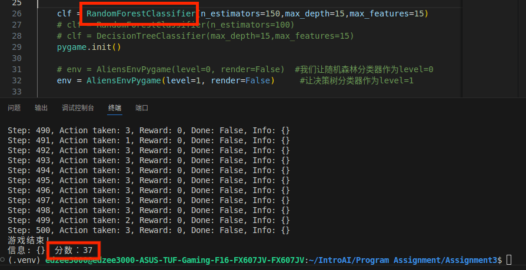
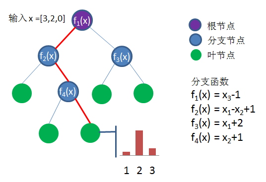
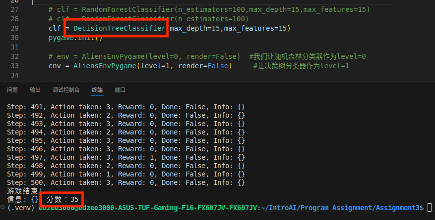
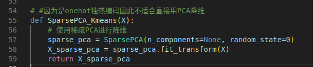
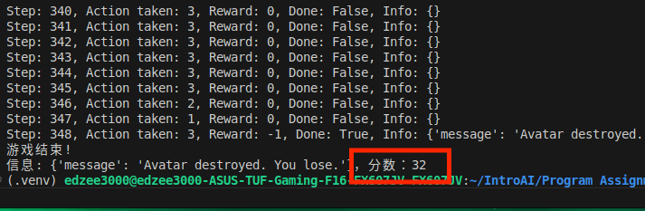
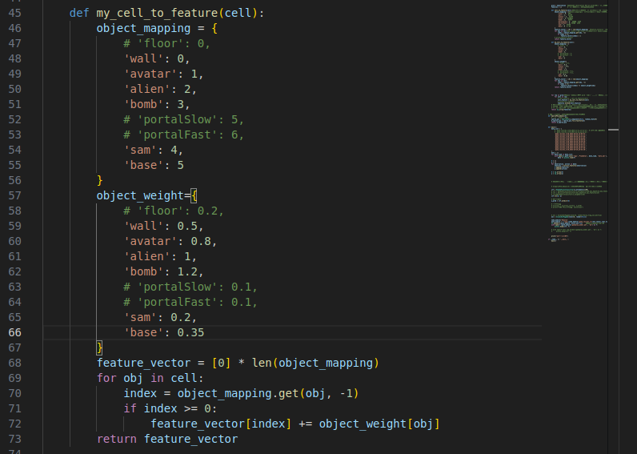

# 作业3: Aliens游戏
## 231300027朱士杭

## 学习方法介绍
### 随机森林 RandomForest

随机森林（Random Forest）是一种基于树模型的集成学习方法，它通过组合多个决策树来提高分类或回归任务的准确性和稳定性。以下是随机森林分类方法的主要特点和原理：

随机森林由多个决策树组成，每个决策树都是一个分类器。
在进行分类时，随机森林会对每个决策树的结果进行投票，选择票数最多的类别作为最终分类结果。集成中的每个决策树都由使用替换法从训练集中抽取的数据样本组成，这些样本称为自助样本。在该训练样本中，有三分之一被留作测试数据，称为袋外样本，我们稍后会对其进行介绍。然后，通过 Feature Bagging 添加另一个随机性实例，从而增加数据集的多样性并降低决策树之间的相关性。问题的类型不同，最终预测的确定方法也会有所不同。对于回归任务，将取各决策树的平均值，而对于分类任务，将根据多数票（即，出现频率最高的分类变量）产生预测类。最后，使用袋外样本进行交叉验证，最终确定该预测。

在构建每棵决策树时，随机森林从原始数据集中随机有放回地（Bootstrap方式抽样）抽取一个子集作为训练数据。每棵树在节点分裂时，会从所有特征中随机选择一部分特征，再从中选择最优特征进行分裂。

随机森林引入了两个随机性：一个是数据集的随机抽样，另一个是特征选择的随机性。这两个随机性使得随机森林具有很好的泛化能力，减少了过拟合的风险。

<!-- -->


随机森林能够处理大量的特征，易于确定特征重要性，可以轻松评估变量对模型的重要性或贡献。可以采用几种方式来评估特征的重要性。基尼重要性和平均不纯度减少 (MDI) 通常用于衡量排除给定变量时模型准确度的降低程度。然而，排列重要性也是衡量重要性的另一个指标，它又称平均精确度减少(MDA)。MDA 通过随机排列袋外样本中的特征值来确定精确度的平均下降程度。

由于采用了集成学习方法，随机森林的准确率通常高于单个决策树。决策树存在过度拟合的风险，因为它们倾向于严格拟合训练数据中的所有样本。但是，当随机森林中存在大量决策树时，分类器便会降低模型过拟合的风险，因为对不相关的决策树取平均值会降低整体方差和预测误差。

随机森林能够很好地处理缺失值和异常值，也具有很好的抗噪声能力，对于噪声数据和不相关的特征不敏感。Feature Bagging 即使在缺少部分数据时仍能保持准确性，这也使随机森林分类器成为估算缺失值的有效工具，提高灵活性。

但是随机森林也有一些缺点（但说实话这个是没办法的因为No Free Lunch定理）。
在处理大规模数据集时，由于需要计算每个决策树的数据，提供的预测更准确，也导致数据处理速度缓慢，训练时间可能会较长（这也是准确性与效率之间的一种trade-off）。
随机森林的可解释性不如单个决策树，因为它是多个决策树的组合而且引入了两种随机性。

在RandomForest随机森林中有一些比较核心的参数（虽然有些是默认的但是调参也是一种艺术）。
首先是决策树的数量n_estimators，通常数量越多，模型的性能越好，但训练时间也会相应增加。
其次是在分裂节点时考虑的特征数量max_features，较小的值可以减少过拟合，但可能会降低模型的性能。
然后是决策树的最大深度max_depth，限制深度可以防止过拟合。


在原本test.py框架代码中，随机森林分类器RandomForestClassifier被用于预测游戏动作。通过加载预训练的模型，代码可以实现对游戏环境的观察，提取特征，然后使用随机森林模型预测下一步应该采取的动作。这个过程不断循环，直到游戏结束或者达到设定的步数上限500个step。最终经过多次test测试之后可以得出最终的score得分集中于27~37之间，而且是在步数只有500上限的情况下，这个得分已经很不错了。




### 决策树 DecisionTree
既然已经提到了随机森林这种方法了，那就不妨将其涉及到的决策树DecisionTree方法也顺带着介绍一下吧，最后在对比一下二者的性能如何

决策树是一种非参数监督学习算法，可用于分类和回归任务。它具有分层的树形结构，由根节点、分支、内部节点和叶节点组成。

决策树一般由方块结点、圆形结点、方案枝、概率枝等组成，方块结点称为决策结点，由结点引出若干条细支，每条细支代表一个方案，称为方案枝；圆形结点称为状态结点，由状态结点引出若干条细支，表示不同的自然状态，称为概率枝。每条概率枝代表一种自然状态。在每条细枝上标明客观状态的内容和其出现概率。在概率枝的最末稍标明该方案在该自然状态下所达到的结果(收益值或损失值)。这样树形图由左向右，由简到繁展开，组成一个树状网络图。

从下图中可以看出，决策树从根节点开始，该节点没有任何传入分支。然后，来自根节点的传出分支馈送到内部节点，也称为决策节点。根据可用功能，两种节点类型都会开展评估以形成同质子集，这些子集用叶节点或终端节点表示。叶节点代表数据集内所有可能的结果。



这种类型的流程图结构还能轻松表示决策过程，让不同群体都能更好地理解决策的原因。决策树学习采用分而治之的策略，通过执行贪心搜索来识别树中的最佳分割点。然后，以自上而下的递归方式重复此分割过程，直到所有或大多数记录都被归类到特定的类标签下。所有数据点是否都被归类为同质集合在很大程度上取决于决策树的复杂性。较小的决策树更容易获得纯净叶节点，即单个类中的数据点。

然而，随着决策树规模的增大，维持这种纯度变得越来越困难，通常会出现指定子树内的数据过少的情况。这种情况被称为数据碎片，并且往往会造成过度拟合。因此，决策树最好采用小树，这与奥卡姆剃刀中的简约原则一致“如无必要，勿增实体”。换句话说，仅在必要时才增加决策树的复杂性，因为最简单的解释往往就是最佳解释。为了降低复杂性并防止过度拟合，通常会采用修剪的方法；这是一个过程，用于去除依据重要性较低的特征分割出的分支。之后，可以通过交叉验证过程来评估模型的拟合度。决策树保持准确性的另一种方法是通过随机森林算法构建集成；此分类器预测的结果更为准确，尤其是在个别树彼此不相关的情况下。


决策树主要有3种常用的方法——ID3、C4.5和CART算法
- ID3： 该算法的开发归功于 Ross Quinlan，全称为"迭代二叉树 3 代" ("Iterative Dichotomiser 3")。 该算法利用信息熵与信息增益作为评估候选拆分的指标。  来自Quinlan 自 1986 年对这种算法的研究。

- C4.5：该算法是 ID3 的后期扩展，同样由 Quinlan 开发。 它可以使用信息增益或增益率来评估决策树中的切分点。 

- CART：术语 "CART" 的全称是"分类和回归"，提出者是 Leo Breiman。 该算法通常利用"基尼不纯度"来确定要拆分的理想属性。 基尼不纯度衡量随机选择的属性被错误分类的频率。 使用该评估方法时，基尼不纯度越小越理想。


它们虽然有一些小小的区别但是它们都用到了物理学里面的“熵”的概念，
如果不先讨论熵的概念，便很难解释何为信息增益。熵是源于信息论的一个概念，它可用于衡量样本值的不纯度。它可通过以下公式来定义，$Entropy(S)=-\sum_{c\in C}p(c)\log_2p(c)$

其中，S 表示计算熵所用的数据集，
c 表示集合 S 中的类，
p(c) 表示属于 c 类的数据点占集合 S 中总数据点数量的比例

熵的值介于 0 和 1 之间。如果数据集 S 中的所有样本都属于一个类，则熵将等于零。如果一半的样本归类为一类，另一半样本归类为另一类，则熵将达到最高值 1。为了选择分割依据的最佳特征并找到最佳决策树，应使用熵量最小的属性。信息增益表示依据给定属性进行分割之前和之后熵的差异。信息增益最高的属性将产生最佳分割，因为它在根据目标分类对训练数据进行分类方面表现最好

虽然可通过多种方法在每个节点上选择最佳属性，但信息增益和基尼系数这两种方法可以说是决策树模型的主流分割标准。它们有助于评估每个测试条件的质量以及将样本分类的能力。

基尼系数是指根据数据集的类分布标记数据集中的随机数据点时，对此随机数据点进行错误分类的概率。与熵类似，如果设置了 S，且 S 是纯净的，即属于同一类，则其系数为零。 $Gini\ Impurity=1-\sum_i(p_i)^2$


理论上来说，决策树让人更容易理解，解释性很强，布尔逻辑和可视化表达方式使其更易于理解和使用。借助决策树的分层特性，人们还能轻松看出哪些属性最重要，而其他算法（如神经网络）并不能给予很好的解释。决策树有许多特征，因而比其他分类器更灵活。它可以处理各种数据类型，例如离散或连续值，且连续值可以通过使用阈值转换为分类值。此外，它还可以在存在缺失值的情况下对值进行处理，其他分类器（如 Naïve Bayes）对此问题可能束手无策。决策树相比于其他很多算法（比如SVM、聚类等）更加灵活，既可用于分类任务，也可用于回归任务，因此比其他一些算法更加灵活。此外，它对属性之间的底层关系不太敏感，这意味着如果两个变量高度相关，该算法将只选择其中一个特征进行分割。

但是决策树缺点也相当明显，主要有2个（只是我自己个人认为）：
1. 容易过拟合：复杂的决策树往往会出现过拟合，并且不能很好地用于新数据。 这种情况可以通过预剪枝或后剪枝来避免。 预剪枝在数据不足时停止决策树的发展，而后剪枝在决策树形成后删除数据不足的子树。 

2. 预估器方差高： 数据中的微小变化会产生非常不同的决策树。 Bagging算法或估计值的平均值可以降低决策树方差。 然而，这种方法使用起来有限，会产生高度相关的预测器。  



结果竟然发现，最终单个决策树的得分score竟然和随机森林决策树不相上下，这很奇怪，我差一点以为是理论和实际有偏差了，结果后来回顾gif发现，原来是score的得分设置有点问题，Alien如果射击方块的话也可以得分，然后决策树大部分得分都是打在了屏障方块上面去了，最终因为消灭敌人而获得的得分寥寥无几，而且表现相当不稳定，得分从20~37分不等，而且同样是在一个模型上运行……

后来发现原来是我自己的问题……我在learn.py当中是使用随机森林分类器进行训练模型，结果在test.py当中使用了决策树分类器进行加载，结果一开始表现得还算可以，当我意识到我自己出问题了以后，我将learn.py和test.py中的分类器方法统一起来后发现决策树分类器的性能一落千丈，走了不到200步就死掉了，最后得分仅有个位数（相当凄惨）。实际情况和理论之间确实是相符合的，看来确实决策树的性能确实大大不如随机森林（确实人多力量大）。


### KNN算法（K-Nearest Neigbors Classification）
　 
K最近邻(KNN，K-NearestNeighbor)分类算法是指数据挖掘分类技术中最简单的方法之一。所谓K最近邻，就是K个最近的邻居的意思，说的是每个样本都可以用它最接近的K个邻居来代表。

　　KNN算法的核心思想是如果一个样本在特征空间中的K个最相邻的样本中的大多数属于某一个类别，则该样本也属于这个类别，并具有这个类别上样本的特性。该方法在确定分类决策上只依据最邻近的一个或者几个样本的类别来决定待分样本所属的类别。 KNN方法在类别决策时，只与极少量的相邻样本有关。由于KNN方法主要靠周围有限的邻近的样本，而不是靠判别类域的方法来确定所属类别的，因此对于类域的交叉或重叠较多的待分样本集来说，KNN方法较其他方法更为适合。

　　KNN算法不仅可以用于分类，还可以用于回归。通过找出一个样本的K个最近邻居，将这些邻居的属性的平均值赋给该样本，就可以得到该样本的属性。更有用的方法是将不同距离的邻居对该样本产生的影响给予不同的权值(weight)，如权值与距离成反比。

接下来我们具体讨论一个例子（虽然这个是非常简单显而易见的一种方法，但还是多说一说吧）

如图所示，有两类不同的样本数据，分别用蓝色的小正方形和红色的小三角形表示，而图正中间的那个绿色的圆所标示的数据则是待分类的数据。也就是说，现在， 我们不知道中间那个绿色的数据是从属于哪一类（蓝色小正方形or红色小三角形），下面，我们就要解决这个问题：给这个绿色的圆分类。


　　我们常说，物以类聚，人以群分，判别一个人是一个什么样品质特征的人，常常可以从他/她身边的朋友入手，所谓观其友，而识其人。我们不是要判别上图中那个绿色的圆是属于哪一类数据么，好说，从它的邻居下手。但一次性看多少个邻居呢？从上图中，你还能看到：

　　如果K=3，绿色圆点的最近的3个邻居是2个红色小三角形和1个蓝色小正方形，少数从属于多数，基于统计的方法，判定绿色的这个待分类点属于红色的三角形一类。

　　如果K=5，绿色圆点的最近的5个邻居是2个红色三角形和3个蓝色的正方形，还是少数从属于多数，基于统计的方法，判定绿色的这个待分类点属于蓝色的正方形一类。

　　于是我们看到，当无法判定当前待分类点是从属于已知分类中的哪一类时，我们可以依据统计学的理论看它所处的位置特征，衡量它周围邻居的权重，而把它归为(或分配)到权重更大的那一类。这就是K近邻算法的核心思想。


总结一下，k近邻算法 (KNN) 的目标是识别给定查询点的最近邻，以便我们可以为该点分配一个类标签。 为了做到这一点，k近邻算法 (KNN) 最为核心的就是要:确定距离度量。虽然距离度量有很多种，但是我们一般就是使用二范数（欧几里得距离），并且在aliens游戏里面我们也默认是欧几里得距离$d(x,y)=\sqrt{\sum_{1}^{n}(y_i-x_i)^2}$


KNN另一个核心就是要定义k的值。
k近邻算法 (KNN) 中的 k 值定义了将检查多少个邻居以确定特定查询点的分类。 例如，如果 k=1，实例将被分配到与其单个最近邻相同的类。 定义 k 可以是一种平衡行为，因为不同的值会导致过拟合或欠拟合。 k 值越小，可能导致方差越大，但如果偏差较低，以及 k 值越大可能导致偏差较高且方差较低。 k 的选择将很大程度上取决于输入数据，因为具有更多异常值或噪声的数据可能会在 k 值较高时表现更好。 总体而言，建议 k 使用奇数以避免分类联系，交叉验证策略可以帮助你为数据集选择最佳 k。


KNN算法因其提出时间较早，随着其他技术的不断更新和完善，KNN算法的诸多不足之处也逐渐显露，因此许多KNN算法的改进算法也应运而生。
1. 分类效率：事先对样本属性进行约简，删除对分类结果影响较小的属性，快速的得出待分类样本的类别。该算法比较适用于样本容量比较大的类域的自动分类，而那些样本容量较小的类域采用这种算法比较容易产生误分。
2. 分类效果：采用权值的方法（和该样本距离小的邻居权值大）来改进，Han等人于2002年尝试利用贪心法，针对文件分类实做可调整权重的K最近邻居法WAKNN (weighted adjusted K nearest neighbor)，以促进分类效果；而Li等人于2004年提出由于不同分类的文件本身有数量上有差异，因此也应该依照训练集合中各种分类的文件数量，选取不同数目的最近邻居，来参与分类。


在aliens游戏当中，算法先提取特征，将每个格子点转化为一个one-hot独热编码，然后我其实一开始有想过因为特征向量太大了，比如一条onehot编码有9个0-1变量，然后一共差不多有20*30个格子（数量级上面应该大差不差），那么在X这个矩阵当中一条向量features就有将近5400个维度，这个维度其实很恐怖的。所以我有想过能不能先进行一些降维操作，比如使用PCA降维先将维度降低到100以内，但是我又一想，独热编码应该不适合直接应用PCA降维吧，因为独热编码的矩阵太稀疏了。独热编码产生的是非常稀疏的数据，每个特征（即类别）只有一个元素是1，其余都是0。稀疏数据可能会导致PCA在计算协方差矩阵时出现问题。那还有一种稀疏PCA的方法，可能更适合用于处理独热编码数据？


结果我去试了一下使用Sparse PCA方法去降维，结果训练模型的时候直接卡死了，效率特别慢，不是算法错误的问题，而是将一个上千维的数据降低到几十维确实有点为难PCA算法了，更何况不只是只有一条数据，我们假设一次游戏平均来说有1000个steps，然后有8场游戏数据，那么这样说就有8000条数据去进行降维，这效率太低了……



因此我决定还是放弃降维操作了，还是直接进行KNN算法吧，最后1s之内就可以训练出模型了，然后将其应用到test.py当中发现最后的模型效果也还算不错吧，虽然aliens特别容易死而且每次发射炮弹都不是打怪兽而是打到面前的墙上，得分还算可以吧。然后看上去aliens的表现也还算不错，但是得分相当不稳定（因为非常容易死），从15~43不等，很不错的。



最后我们再简单分析一下，因为KNN是强烈依赖于数据的经验的，因为是寻找几个最近的特征数据及其对应的标签，因此玩家玩的好不好对最后aliens的表现影响也是很大的。


## 改进特征提取方法

### 筛选一下特征？
为了减少一些不必要的特征，因为我们人为观察可以发现，对于在X中的一条独热编码向量（本质就是一条0-1序列），其中某些位置永远为0或者为1，因为在一个图像当中有些位置物块、炮弹、怪兽是永远没有办法到达的，那么这些地方就应该被摒弃，这样可以大大缩小整个矩阵的大小。

但是这个方法好像有点问题，没有办法被封装在extract_features函数当中，需要根据已经有的X训练数据进行降维，而且在test测试过程也不能保证已经被降维的部分会不会发生改变，因此最终我还是放弃了这种方法


### 赋予不同的权重
在我STFW的过程中，我发现，独热编码one-hot经常和另一个方法一起出现——TF-IDF算法。
IF-IDF是信息检索（IR）中最常用的一种文本表示法。算法的思想也很简单，就是统计每个词出现的词频（TF），然后再为其附上一个权值参数（IDF）。从这个算法我产生了一些思考，那能不能也给每个object附上一个权重呢？

因为在整个游戏界面当中会发现地面占据大部分，但是地面并不是非常重要，我们关注的是玩家avatar的动作，而影响avatar动作的只有wall、alien和bomb，而地面的位置对于avatar的影响微乎其微。甚至于wall、alien和bomb这三个对象对于avatar的影响也不是同等地位的，wall可以帮助阻挡也可以帮助得分，但是bomb和alien位置的影响更大，而且bomb是直接影响avatar的存亡的因而更重要，因此给予它们的权重 $bomb>alien>wall$

为什么要加入权重的因素影响？？
第一当然是为了区分重要性，不同的对象对玩家的行动有不同的影响。例如，炸弹（bomb）可能比墙壁（wall）对玩家的生存威胁更大，因此我们可以给炸弹更高的权重。
其次还能减少噪声，地面（floor）可能占据了大部分的游戏界面，但对玩家的决策影响很小。通过降低地面的权重，我们可以减少这些不重要信息对模型的影响。通过赋予不同对象不同的权重，我们可以使特征向量更加精确地反映环境状态对玩家行动的影响。

通过观察还能够发现，在本游戏当中根本就没有出现过floor、portalSlow以及portalFast（通过print输出可以发现），因此原本的feature_vector向量其实用不着有9维，其实只有6维已经足够了，在原本框架的基础上，我仿照着cell_to_feature函数写了一个自己的转换特征的函数，然后经过不懈地调参（真的痛苦啊这个过程），最后找到了一个相对来说还不错的参数组合（如下图所示）。

按照这个参数组合去test的话可以发现确实角色更加灵活了，不像之前那么容易死了，但是对应的其实得分更低了，因为在之前角色的得分主要是由击中墙壁可以获得大部分的分数，但是由于我将墙壁的权重调低了（因为其实我们更希望的是角色去击中alien而不是靠墙壁去“刷分”），因此总体来说的得分确实比之前低了一些，但是由于击中alien的得分相比较来说却大大提升了，这其实说明了算法的性能得到了一些提升



其实说实话为什么调参的过程那么痛苦就是因为每次都要自己手动去调整参数组合，然后还要复制path到test当中，然后还要等待最后的得分而且得分还不够稳定不仅仅需要运行一次……所以我在想能不能写个程序自动化调参？大概思路应该就是（好吧其实是因为我懒不愿意写）：调整参数组合->多次运行得出平均得分以及方差->微小改动参数组合->重新多次运行（之后就可以使用一些演化式算法去优化出“最佳”参数组合）。


### 类似于卷积神经网络当中的卷积操作？
一个非常不切实际的想法，能不能借鉴一下深度学习当中的卷积操作？比如我先拿一个 3\*3 的卷积核去扫描一遍整个平面，然后对其 3\*3 的部分进行取平均值/高斯分布的操作，然后作为这个部分的特征值？

但是我后来又一想感觉不太对劲，如果这样的话为什么不一开始就把所有单元格的值作为特征向量的内容加到vector里面去呢？而是要采用一个0-1独热编码岂不是多此一举？

更何况进行卷积之后整个平面其实更加“模糊”了，这个适合让神经网络去做，但是如果只是给一个普通的有监督学习的模型的话，不敢保证效果会很好，好吧其实还是我太懒了所以没去试一试，但是理论分析一下感觉还是效果不是很好。

### 计算一下角色周围几列外星人、炮弹的数量？
我在想一个问题，其实角色只能够左右移动对吧，然后主要是为了规避一下炮弹以及以较大的概率去打中一个alien，而且alien只在某一行移动，炮弹只在某列上下移动，那么就可以创建出新的四维特征分别代表角色左右各3列（遇到了边缘就不算了）的外星人和炮弹的个数以及最近炮弹距离角色方向（左为1，中为2，右为3）、高度（如果没有的话就均为0即可）。具体实现感觉太麻烦了, 因此我就在这里稍微写一写相关的代码然后移植过去即可
```python
def extract_features(observation):
    ...
    ... #其它代码
    def count_aliens_and_bombs(grid, player_position, object_mapping):
        # 初始化计数器
        alien_count_left = 0
        alien_count_right = 0
        bomb_direction = 0
        bomb_height = 0
        bomb_distance = float('inf')
        # 计算外星人数量
        for i in range(len(grid)):
            for j in range(max(0, player_position[1] - 3), min(len(grid[0]), player_position[1] + 3)):
                if j < player_position[1]:
                    alien_count_left += 'alien' in grid[i][j]
                elif j > player_position[1]:
                    alien_count_right += 'alien' in grid[i][j]
        # 计算最近炮弹的方向和高度
        for i in range(len(grid)):
            for j in range(len(grid[0])):
                if 'bomb' in grid[i][j]:
                    distance = abs(i - player_position[0]) + abs(j - player_position[1])
                    if distance < bomb_distance:
                        bomb_distance = distance
                        bomb_height = i
                        if j < player_position[1]:
                            bomb_direction = 1
                        elif j == player_position[1]:
                            bomb_direction = 2
                        else:
                            bomb_direction = 3
        # 如果没有炮弹，将方向和高度设置为0
        if bomb_distance == float('inf'):
            bomb_direction = 0
            bomb_height = 0
        return [alien_count_left, alien_count_right, bomb_direction, bomb_height]
    for row in grid:
        for cell in row:
            cell_feature = my_cell_to_feature(cell)#已经写好了my_cell_to_feature函数
            features.extend(cell_feature)
    #在features的最后添加我们设定好的特征
    features.extend(count_aliens_and_bombs(grid, player_position, object_mapping))
    return np.array(features)
```
其实如果考虑的更全面的话，还可以将角色周围几列（至于具体是周围几列就是要靠自己去调整参数了）分别有多少个墙壁也作为新的特征加入进去讨论的话也是可以的，毕竟这个对最终角色的行为也会产生一定的影响。但是这个是我写完代码之后才想到的一个想法，再去添加内容也没有什么必要了，想要表达的意思到了就行。

关键是我们需要知道的是，特征提取与选择会对算法的性能带来非常大的影响，因为一个好的特征可以让算法的性能得到大幅提升，尽量避免过拟合和欠拟合，同时，良好的特征提取方法可以产生可解释的特征，这意味着模型的决策过程更容易被人类理解和解释。总之，特征提取是连接原始数据和机器学习模型的桥梁，它直接影响到模型的性能、可解释性和实用性。


### 能不能引入一些空间特征？
我们可以引入空间特征，即考虑每个单元格与其周围单元格之间的相对位置信息。这种方法可以帮助模型理解环境中的空间结构，例如玩家（avatar）与墙壁（wall）、外星人（alien）和炸弹（bomb）的相对位置，从而做出更好的决策。（但是后来我决定还是放弃这种方法，因为没有办法将其规范化转化为numpy数组的时候没有办法进行对齐，墙壁和外星人的个数都是在动态变化着）

我们可以定义空间特征为每个单元格与其周围单元格之间的距离。这些距离可以是欧几里得距离、曼哈顿距离或其他适当的距离度量。

比如我们可以修改extract_features特征提取函数为：
```python
def extract_features(observation):
    grid = observation
    features = []
    object_mapping = {
        'floor': 0,
        'wall': 1,
        'avatar': 2,
        'alien': 3,
        'bomb': 4,
        'portalSlow': 5,
        'portalFast': 6,
        'sam': 7,
        'base': 8
    }
    def cell_to_feature(cell, row_idx, col_idx, grid_size):
        feature_vector = [0] * len(object_mapping)
        for obj in cell:
            index = object_mapping.get(obj, -1)
            if index >= 0:
                feature_vector[index] = 1
        # 计算与玩家的曼哈顿距离
        if 'avatar' in cell:
            avatar_idx = list(object_mapping.values()).index(object_mapping['avatar'])
            feature_vector[avatar_idx] += 10  # 增加玩家自身的权重
        # 计算与周围单元格的距离
        for i in range(max(0, row_idx - 1), min(row_idx + 2, grid_size[0])):
            for j in range(max(0, col_idx - 1), min(col_idx + 2, grid_size[1])):
                if (i, j) != (row_idx, col_idx):
                    dist = abs(i - row_idx) + abs(j - col_idx)
                    if grid[i][j]:
                        obj = list(grid[i][j])[0]
                        index = object_mapping.get(obj, -1)
                        if index >= 0:
                            feature_vector.append(dist * object_mapping[obj])
        return feature_vector
    for i, row in enumerate(grid):
        for j, cell in enumerate(row):
            cell_feature = cell_to_feature(cell, i, j, (len(grid), len(row)))
            features.extend(cell_feature)
    return np.array(features)
```
从理论上来说这种方法包括这个代码是可以运行起来的，但是实际上由于一些边界情况（边界单元格）以及变长特征向量，没有办法将X变为一个ndarray标准大小的数组，如果要适应这个新的特征向量的长度和结构，可能就需要重新调整整个游戏的架构，得不偿失啊……最后想想还是算了吧，但是从理论上这个是可行的，因为如果我们添加了方向性特征，模型知道了相对位置的话，这可以帮助模型了解角色周围的环境，以及如何与周围的对象互动。同时，我们保留了原有的单元格特征，以便模型可以继续利用这些信息。如果代码实现的好不出意外的话，模型的整体性能当然会得到提升。当然了由于我能力有限（也可能是太懒了），代码写的不太行，因此不太能去将我的想法付诸于实现，在此进行自我批评。


## 一些对源代码框架的修改

注意我在原本框架代码上做了一些细微的修改

因为原本框架代码里面把训练数据、模型数据、结果数据全都混杂在同一个logs日志文件夹中
导致我查找对应的路径非常麻烦

因此我将它们都分开了，但是在这里就得注意问题了，我在play.py文件中的__init__函数当中添加了一个默认参数flag_AI=True
在test.py当中需要手动传入flag_AI=False这个参数保证不会自动
```
os.makedirs(self.log_folder, exist_ok=True)
```
不然的话每一次在learn.py以及test.py当中调用```env = AliensEnvPygame(level=0, render=False)```这段代码的话都得在PlayDatas这个目录下面再新创建一个空的目录，特别烦人……不如一劳永逸

另外在play.py文件当中的save_gif函数我也手动添加了一个path默认参数用来手动传递存储gif的路径

如果你需要训练数据的话，需要从logs/PlayDatas文件夹下面复制目录到learn.py的data_list当中去；如果你需要使用模型的话，需要从logs/Modules文件夹下面复制模型.pkl文件到test.py的model_path当中去


