# Assignment4 Report
## 231300027 朱士杭
## 强化学习的方法和过程
### 环境背景CartPole倒立摆游戏介绍
Cart Pole 是一个倒立摆问题，一根杆子通过非驱动接头直立放置在小车上，小车沿着无摩擦的轨道移动。目标是通过在小车上向左和向右施加力来平衡杆，坚持得越久越好。具体的环境说明可以查看[openai Wiki](https://github.com/openai/gym/wiki/CartPole-v0)相关详细说明和介绍，这里我就大致讲一下这个问题背景需要我们去干吗。

给出两个动作构成一组动作空间：
1. 动作 0: Push cart to the left （推动小车向左）
2. 动作 1: Push cart to the right （推动小车向右）

状态空间则有四个参数：
1. Cart Position $x$： 小车位置，即 x 坐标轴的范围
2. Cart Velocity $v$： 小车速度
3. Pole Angle $\theta$： 极角，即杆子和垂直线之间的夹角
4. Pole Angular Velocity $\omega$： 杆子绕其轴的角速度，即其倾斜速率的快慢

初始状态中的每个参数均在 (-0.05, 0.05) 之间统一初始化，如果发生以下情况之一，则回合终止： 极角大于 ±12°、小车位置大于 ±2.4 （小车中心到达显示屏边缘）、 回合步数大于 500
（可以视条件“回合步数大于 500”就是成功完成挑战的条件，因为只有达到步数上限才能得到最大奖励）  

源代码框架没有给出问题背景的可视化结果，因此我自己手动添加了几条env.render()渲染语句去实现可视化

### 强化学习阐述
根据Richard S. Sutton and Andrew G. Barto 在《Reinforcement Learning: An Introduction II》这本书中提到，强化学习（Reinforcement learning，RL）讨论的问题是一个智能体(agent) 怎么在一个复杂不确定的环境(environment)中交互学习，去极大化它能获得的奖励。通过感知所处环境的 状态(state) 对 动作(action) 的 反应(reward)， 来指导更好的动作，从而获得最大的 收益(return)。

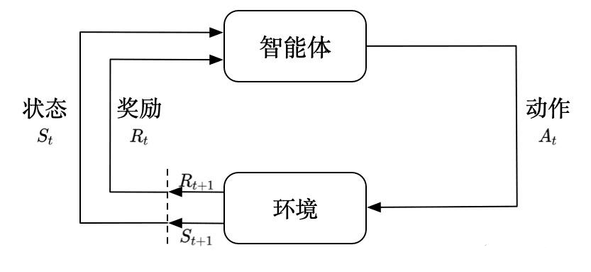

在强化学习过程中，智能体跟环境一直在交互。智能体在环境里面获取到状态，智能体会利用这个状态输出一个动作，一个决策。然后这个决策会放到环境之中去，环境会根据智能体采取的决策，输出下一个状态以及当前的这个决策得到的奖励。智能体的目的就是为了尽可能多地从环境中获取奖励。

相比与大众熟知的监督学习与非监督学习，强化学习更像从错误中学习，偏重于智能体与环境的交互， 这带来了一个独有的挑战 ——“探索（exploration）”与“（exploitation）”之间的折中权衡，智能体必须开发已有的经验来获取收益，同时也要进行试探，使得未来可以获得更好的动作选择空间。 (从错误中学习)

强化学习有两个非常明显的特征——试错学习与延迟汇报。Agent 要以不断与 Environment 进行交互，通过试错的方式来获得最佳策略(Policy)。指导信息很少，而且往往是在事后（最后一个状态(State)）才给出的。比如 围棋中只有到了最后才能知道胜负。这两个特性也就导致了强化学习很在现实生活中得到应用，因为现实生活总是一个开放环境，而Agent需要不停地试错，但是现实生活容错率很低，一点点小错误就可能带来毁灭性的影响，因此目前而言强化学习还是在游戏训练方面应用更多一些（毕竟是一个封闭环境嘛）

一些相关术语介绍一下吧：
策略(Policy)是智能体用于决定下一步执行什么行动的规则。可以是确定性的，一般表示为:
$a_t=\mu(s_t)$ ,也可以是随机的，那就表示为$a_t\sim\pi(·|s_t)$. 状态转移(State Transition)可以是确定的也可以是随机的，一般认为是随机的，其随机性来源于环境。可以用状态密度函数来表示：$p(s'|s,a)=P(S'=s'|S=s,A=a)$， 环境可能会变化，在当前环境和行动下，衡量系统状态向某一个状态转移的概率是多少，注意环境的变化通常是未知的。回报(Return)和奖赏(Reward)注意是不一样的，回报又称cumulated future reward，一般表示为$U_t=R_t+R_{t+1}+R_{t+2}+R_{t+3}+\cdots$，其中$R_{t}$表示第t时刻的奖励，agent的目标就是让Return最大化。但是注意未来的奖励不如现在等值的奖励那么好（就好比钱会贬值一样，在经济学里面有专门的术语叫做折旧率），因此每个项的权重是不一样的！！！$R_{t+1}$的权重应当小于$R_{t}$,，强化学习通常用discounted return（折扣回报，又称cumulative discounted future reward），取$\gamma$为discount rate（折扣率）其$\gamma\in(0,1]$，因此回报真实应当写为:$U_t=R_t+\gamma R_{t+1}+\gamma^2R_{t+2}+\gamma^3R_{t+3}+\cdots$

另外的就是一些价值函数Value Function，使用期望对未来的收益进行预测，一方面不必等待未来的收益实际发生就可以获知当前状态的好坏，另一方面通过期望汇总了未来各种可能的收益情况。使用价值函数可以很方便地评价不同策略的好坏。主要有状态价值函数State-value Function用来度量给定策略$\pi$的情况下，当前状态$s_t$的好坏程度；另一个就是动作价值函数Action-value Function用来度量给定状态$s_t$和策略$\pi$的情况下，采用动作$a_t$的好坏程度。

按照学习方式的不同，强化学习通常被分为在线学习（On-Policy）和离线学习（Off-Policy）两种方式：
- On-Policy是指agent必须本人在场， 并且一定是本人边玩边学习。典型的算法为Sarsa。
- Off-Policy是指agent可以选择自己玩， 也可以选择看着别人玩， 通过看别人玩来学习别人的行为准则， 离线学习同样是从过往的经验中学习， 但是这些过往的经历没必要是自己的经历， 任何人的经历都能被学习，也没有必要是边玩边学习，玩和学习的时间可以不同步。典型的方法是Q-learning，以及Deep-Q-Network。


### DQN（Deep Q Network）介绍
其实强化学习还有另外一个常用的算法Q-Learning算法，但是由于在代码框架里面只给了DQN以及DDQN算法而不涉及Q-Learning，因此这里只是简略介绍一下Q-Learning的相关概念。

在Q-learning中，我们维护一张Q值表，Q值表(Q-Table)是一个简单查找表的名称，我们计算每个状态的最大预期未来奖励。基本上，这张表将指导我们在每个状态采取最佳行动。
表的维数为状态数S * 动作数A，表中每个数代表在当前状态S下可以采用动作A可以获得的未来收益的折现和。我们不断的迭代我们的Q值表使其最终收敛，然后根据Q值表我们就可以在每个状态下选取一个最优策略

Q函数Q-Function即为上面提到的动作价值函数，输入为动作和状态，返回在该状态下执行该动作的未来奖励期望。我们可以把Q函数视为一个在Q-Table上滚动的读取器，用于寻找与当前状态关联的行以及与动作关联的列。它会从相匹配的单元格中返回 Q 值，这就是未来奖励的期望。

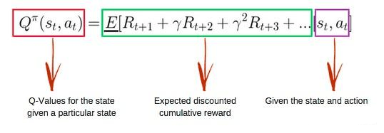

在我们探索环境（environment）之前，Q值表会给出相同的任意的设定值（大多数情况下是 0）。随着对环境的持续探索，Q值表会通过迭代地使用 Bellman 贝尔曼方程（动态规划方程）更新 Q(s，a) 来给出越来越好的近似。

好知道这么多就够了，具体公式就不推了吧反正我也没怎么看明白，还是直接来具体看看DQN吧

在普通的Q-learning中，当状态和动作空间是离散且维数不高时可使用Q-Table储存每个状态动作对的Q值，而当状态和动作空间是高维连续时，使用Q-Table不现实，我们无法构建可以存储超大状态空间的Q_table。不过，在机器学习中， 有一种方法对这种事情很在行，那就是神经网络，可以将状态和动作当成神经网络的输入，然后经过神经网络分析后得到动作的 Q 值，这样就没必要在表格中记录 Q 值，而是直接使用神经网络预测Q值

DQN利用Qlearning特点，目标策略与动作策略分离，学习时利用经验池储存的经验取batch更新Q。同时提高了样本的利用率，也打乱了样本状态相关性使其符合神经网络的使用特点。
神经网络一般学习的是固定的目标，而Qlearning中Q同样为学习的变化量，变动太大不利于学习。所以DQN使Q在一段时间内保持不变，使神经网络更易于学习。

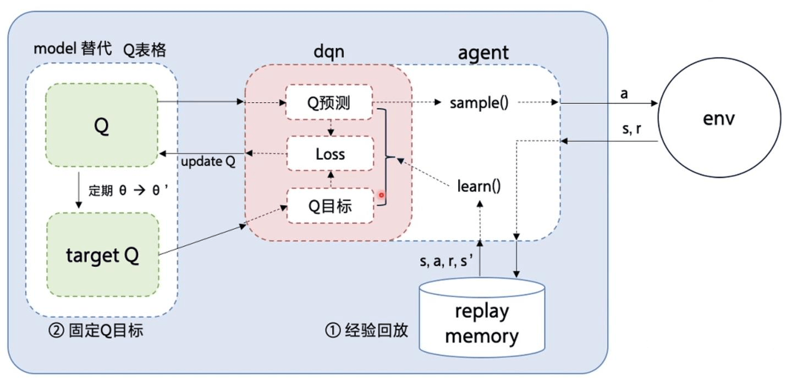

因此可以发现，与传统的Q-learning不同的点主要在于：
- 为了打破数据之间的相关性并提高学习的效率，DQN使用了经验回放（Experience Replay）的技术，会将智能体的经验（状态、动作、奖励、新状态）存储在一个数据集中，也就是代码框架里面的buffer缓冲区，然后从中随机抽取样本进行学习。
- 另外一个就是DQN使用了两个神经网络，一个是在线网络Online Network，用于选择动作；一个是目标网络Target Network，用于计算TD目标Temporal-Difference Target。这两个网络有相同的结构，它们的输入是智能体的状态，输出是对应于各个可能动作的Q值，这种网络结构也被称为Q网络，但参数不同。在每一步学习过程中，我们使用在线网络的参数来更新目标网络的参数，但是更新的幅度较小。在线网络负责智能体的决策，目标网络则保证了学习过程的稳定性。通过这两个网络的配合，DQN能够有效地学习在复杂环境中的最优策略。

### DQN算法的大致流程
DQN算法的大致流程如下：
1. 初始化：首先，初始化在线网络和目标网络（它们具有相同的结构但是参数不同）。然后，创建一个经验回放缓冲区。
2. 探索与利用：智能体在每个时间步会选择一个动作。动作的选择可以是随机的（探索），也可以是根据在线网络预测的Q值选择的（利用）。通常，我们会使用一个策略（如ε-greedy策略），使得智能体在初期更倾向于探索，在后期更倾向于利用。
3. 交互与存储：智能体根据选择的动作与环境交互，然后观察到新的状态和奖励。这个过程产生了一个转移（状态，动作，奖励，新状态），这个转移被存储在经验回放缓冲区中。
4. 学习：从经验回放缓冲区中随机抽取一批样本，然后使用这些样本来训练在线网络。具体来说，我们计算每个样本的目标值（r + γ * max_a' Q_target(s', a')），然后通过最小化网络预测的Q值和这个目标值之间的差距来更新网络的参数。
5. 更新目标网络：每隔一定的步数，我们将在线网络的参数复制到目标网络。这样，目标网络的参数保持相对稳定，使得学习过程更加稳定。
6. 迭代：重复上述步骤（步骤2-5），直到满足停止条件（如达到最大步数或达到预定的性能标准）。

### 至于DDQN算法
由于DQN在计算现实的动作价值函数Q时，是通过选取可以取得最大Q的行为$a$来更新目标函数，同时他是off-policy策略，因此下一个状态下并不一定会选择行为$a$。因此就会出现过度估计，也就是估计值比现实值要大，导致算法可能会将次优解当成最优解。

DDQN与DQN大部分都相同，只有一步不同，那就是在选择$Q( s_{t + 1} , a_{t + 1} )$的过程中，DQN总是选择Target Q网络的Q值。而DDQN不同，DDQN首先从Q网络中找到Q值的那个动作，然后再找到这个动作对应的Target Q网络的目标Q值。

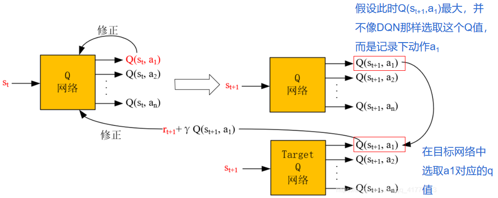

### main.py 代码中 lr, gamma, buffer_size 三个变量分别有何作用？
lr也就是learning rate学习率，是深度学习模型训练中的一个超参数，它控制了模型权重更新的幅度。在强化学习中，学习率决定了智能体在梯度下降过程中每一步对Q网络权重的调整量。在训练过程中，每次智能体从经验中学习时，都会根据计算出的损失来更新Q网络的权重。学习率决定了这一更新的速度。如果学习率太高，可能会导致训练不稳定；如果太低，则训练过程可能会非常缓慢。

$\gamma$折旧因子是强化学习中用于计算回报（reward）时考虑未来奖励的重要参数。它衡量了智能体对未来奖励的重视程度。在Q学习中，未来奖励的总和是通过将每个即时奖励乘以gamma的相应幂来计算的。例如，如果gamma为0.99，则智能体会考虑未来99步的奖励，但每一步的奖励都会相应地减少其影响力。折扣因子接近1意味着智能体对未来奖励的重视程度很高，而接近0则意味着它主要关注即时奖励。在上面计算return回报的时候已经详细说明了为什么有折旧的原因，这里就不赘述了。

buffer_size经验回放缓冲区大小用于存储智能体在环境中的经验（即状态、动作、奖励、下一个状态和是否完成的元组）。这个缓冲区的大小决定了智能体能存储多少经验、在训练过程中，智能体会将每个步骤的经验存储在缓冲区中。当进行学习时，智能体会从缓冲区中随机抽取一批经验来打破数据之间的相关性，从而提高学习的稳定性和效率。一个更大的缓冲区可以存储更多的经验，这有助于智能体从更广泛的经验中学习，但也需要更多的内存资源。在强化学习中，连续的经验往往是高度相关的，这可能导致神经网络在训练时出现偏差。经验回放通过存储和随机抽取经验，打破了数据点之间的这种相关性，使得神经网络能够从更加多样化的数据分布中学习。由于经验回放允许智能体从过去的经验中重复学习，因此它可以更有效地利用有限的数据，提高样本效率。随机抽取经验有助于减少训练过程中的方差，使得学习过程更加稳定。


### agent.py 代码中 act 和 act_no_explore 两个函数有何不同？训练过程中采用act_no_explore函数会有什么问题？

#### 对于act函数
act 函数在决策时采用了$\epsilon$-greedy策略，这意味着它有一定的概率（$\epsilon$）随机选择一个动作，而不是总是选择Q值最大的动作。这是强化学习中常用的探索策略，有助于智能体在训练过程中探索环境。具体来说，如果随机数大于$\epsilon$（探索率），它会选择Q值最大的动作；如果随机数小于或等于ε，它会随机选择一个动作。

$\epsilon$-greedy策略是一种简单而广泛应用于强化学习领域的决策策略。这种策略旨在平衡探索（exploration）与利用（exploitation）之间的关系，以优化决策过程中的长期收益。在$\epsilon$-greedy策略中，$\epsilon$是一个介于0和1之间的参数，代表采取随机探索行为的概率。

- 利用（Exploitation）：大部分时间（具体地，以$1-\epsilon$的概率），决策者会选择当前已知的最佳行动，即那些在过去的尝试中获得最高平均奖励的行动。这反映了利用现有知识来最大化即时奖励的意图。
- 探索（Exploration）：有时候（以$\epsilon$的概率），决策者会随机选择一个行动，而不考虑过去的经验。这有助于发现更好的行动选项，防止算法过早地聚焦于看似最优的选择而忽视了其他潜在的更优解。

当$\epsilon$接近1时，策略倾向于更多的探索，有助于发现新的或未充分探索的行动选项，但可能会牺牲一些即时的奖励。当$\epsilon$接近0时，策略倾向于更多的利用，即重复已知的最佳行动，以最大化短期奖励，但这可能导致错过长期来看更优的行动选项。


#### act_no_explore 函数
act_no_explore 函数总是选择Q值最大的动作，不进行任何随机探索。这意味着它完全依赖于当前的Q网络来做出决策，不包含任何探索成分。由于没有探索，act_no_explore 函数完全依赖于当前的Q网络来选择动作，这可以看作是最大化的利用已知信息。这个函数通常用于评估训练后的智能体性能，或者在确定性的环境中进行决策。

因此在训练过程中完全使用 act_no_explore 函数而不是 act 函数会带来一些问题。
第一肯定就是过拟合了，如果智能体只根据当前的Q网络做出决策，它可能会对训练数据产生过拟合，即只能很好地处理在训练过程中遇到的状态，而无法泛化到未见过的状态。其次就是探索不足，
由于没有随机探索，智能体可能会陷入局部最优，无法发现环境中的其他可能性和策略。
这可能导致智能体在训练初期就收敛到一个次优的策略，无法学习到更优的策略。
另外还可能导致收敛速度慢以及环境适应性差，由于缺乏探索，智能体可能需要更长的时间来发现有用的经验和策略，这会减慢训练过程；在动态变化的环境中，不进行探索的智能体可能无法适应环境的变化，因为它没有机会去尝试新的动作和策略。

直观地来对比一下使用act以及act_no_explore两种情况的不同吧，下面第一张图是使用act函数兼顾探索与利用，第二张图是act_no_explore函数完全没有探索的情况。

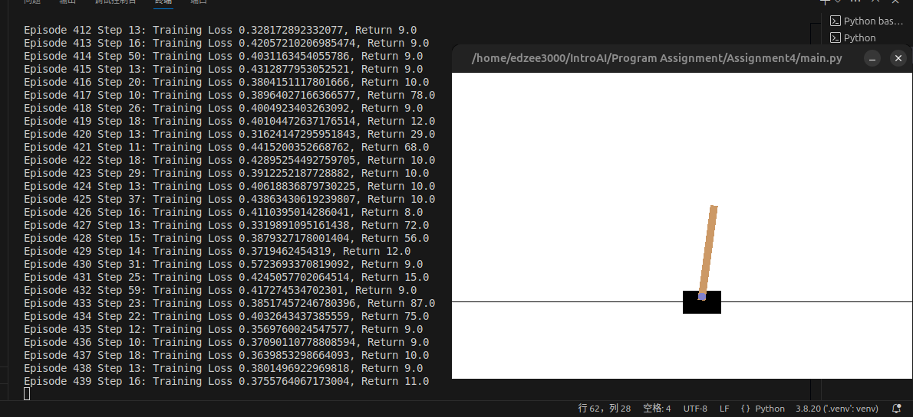

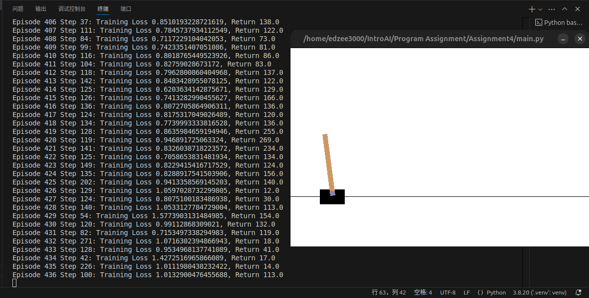

可以发现，同样是训练到四百多回合，如果是使用act_no_explore函数，虽然最终的Return会相比act会大一些，但是另一方面很明显act_no_explore函数的训练均方误差loss会更大。（这里其实我挺奇怪的为什么act_no_explore函数的性能还会比act函数的性能好也就是回报更高，后来我去看了一眼源代码发现计算回报的eval_policy评估函数评估当前agent策略函数是在计算无探索（epsilon=0）情况下的回报，挺奇怪的）。但是后来又想想确实，act函数的$epsilon$是逐渐衰减的，因此收敛速度比较缓慢，但是不容易陷入局部最优解；而act_no_explore函数一下子收敛很快，但是后来就陷入局部最优解了。从短期来看确实act_no_explore函数比act要好，但是从长期来看（比如迭代上万次之后）那必然act会比act_no_explore好很多。

另一方面，我个人猜测其实是超参数没有给好，可以发现epsilon_end的值竟然为0.5，意思就是说即使到了最后迭代了3000次探索和利用的概率之比竟然是1比1，这显然是有问题的（表明到了最后算法仍旧不收敛非常不稳定），因而下面我们将要修改超参数以获得更好的结果


## 尝试修改强化学习参数，得到更好的学习性能，并报告修改的尝试和得到的结果。
通过修改尝试可以发现lr学习率对于结果性能影响挺大的

如果将学习率从0.9变为0.99的话会发现无论epsilon_start与epsilon_end大小如何,对最终的性能提升将有很大帮助

下面这张图对应的是lr从0.9上升为0.99带来的性能的影响，此时epsilon_start与epsilon_end大小不变

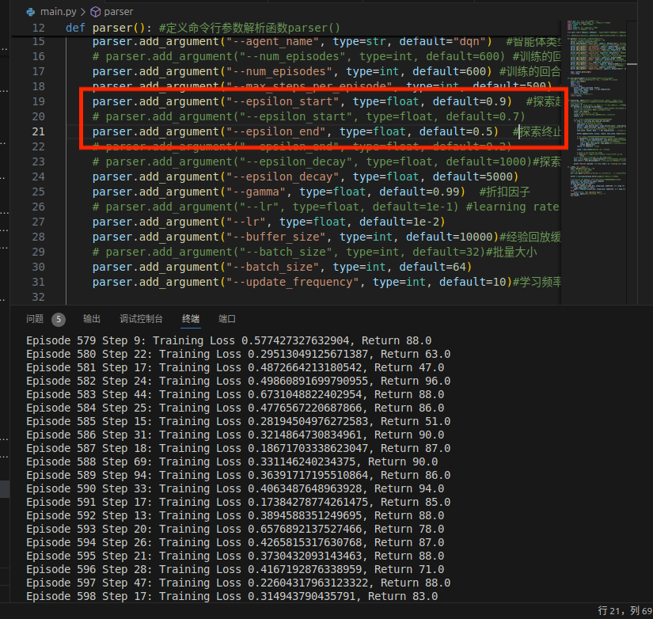

现在再来看看调整epsilon_start与epsilon_end大小之后的性能（如下图所示），可以很明显地发现，当epsilon_start与epsilon_end同时减小之后，越到后面学习性能越好，出现了loss在1以内但是Return可以高达319的情况，这无疑是个振奋人心的结果，说明可以通过调整超参数使得act的性能远远好于act_no_explore，这也说明了我们之前的结论的正确性

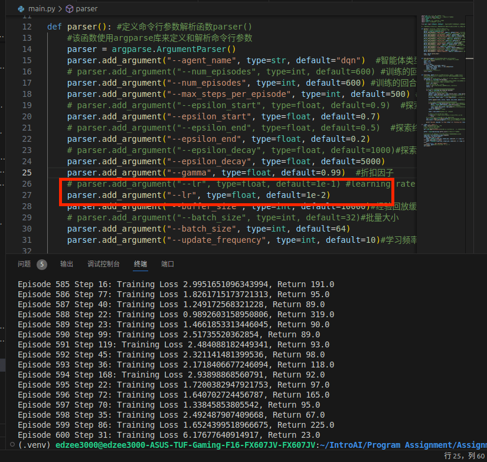

另外还可以发现，训练回合数也不是也多越好（如下图所示），因为越往后虽然更稳定了，但是相应的回报也就少了很多，以及Training Loss也在不断增大，而且episode多的话训练时间相对来说就变长了，权衡一下反而不是好事，不断调试num_episodes的值发现还是保持在600左右是最好的

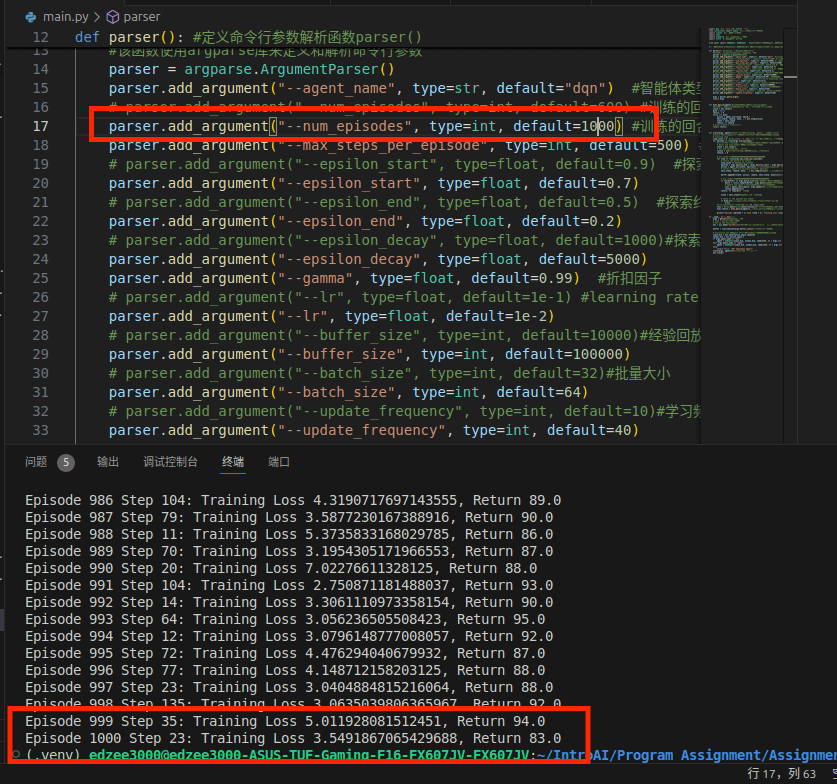

为了让最后的结果更加直观，我决定用matplotlib画图去看看学习性能如何，最后的结果如下面所示，其中既有超参数对于最终回报Return的影响，也有超参数对于TrainingLoss的影响的结果图：

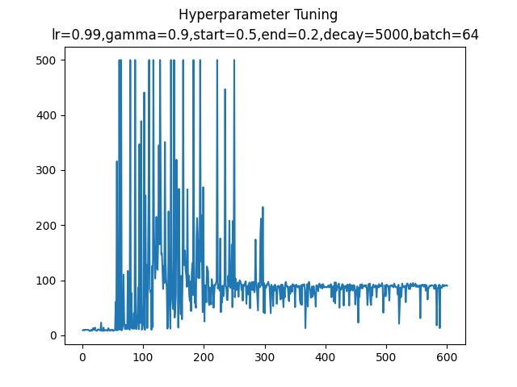
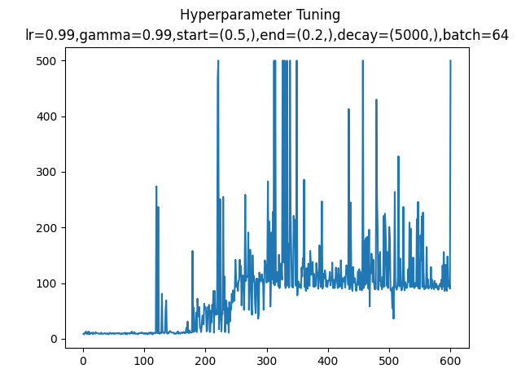
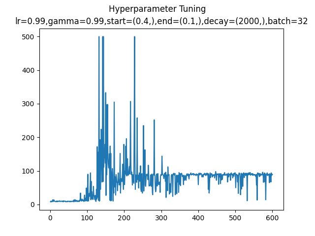
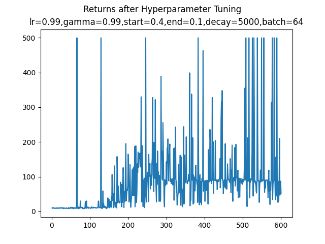
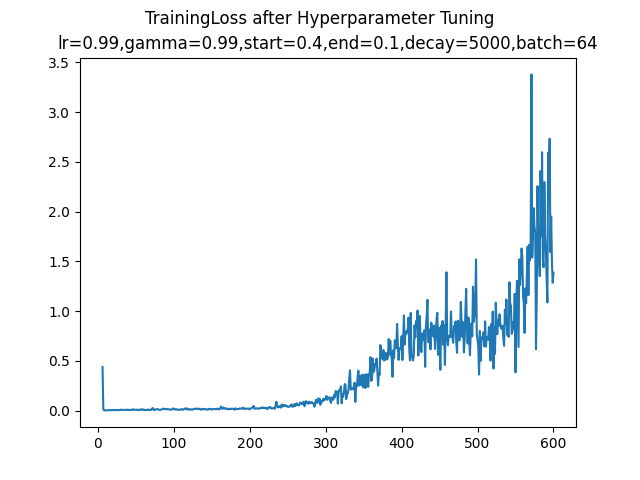
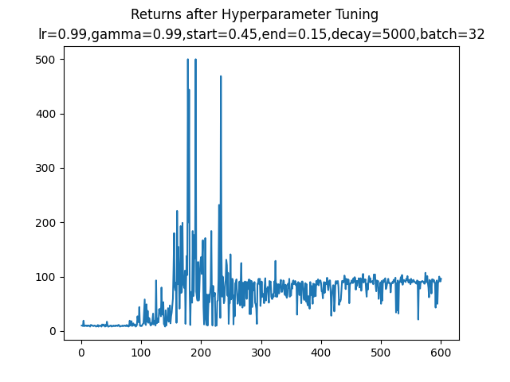
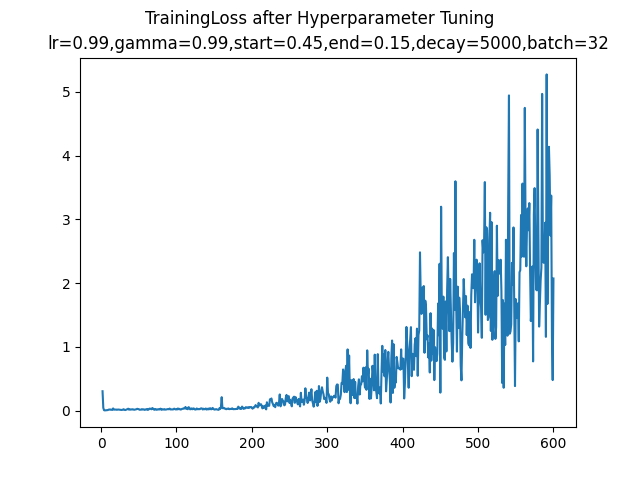

经过选择之后我觉得超参数组合为
```python
agent_name="dqn"
num_episodes=600
max_steps_per_episode=500
epsilon_start=0.4
epsilon_end=0.1
epsilon_decay=5000
gamma=0.99
lr=0.99
buffer_size=20000
batch_size=64
update_frequency=20
```
时整体效果是最好的，也就是如上面第四张图所示


## 尝试修改agent_name为ddqn，与dqn进行对比，分析两者的区别并报告实验结果的区别
DDQN是Double DQN的缩写，是在DQN的基础上改进而来的。DDQN的模型结构基本和DQN的模型结构一模一样，唯一不同的就是它们的目标函数。

$Y_t^{DQN}=R_{t+1}+\gamma \max_a Q(S_{t+1},a;\theta_t^-)$

$Y_t^{DDQN}=R_{t+1}+\gamma Q(S_{t+1},\argmax_a Q((S_{t+1},a;\theta_t);\theta_t^-)$

这两个target函数的区别在于DoubleDQN的最优动作选择是根据当前正在更新的Q网络的参数$\theta_t$ 

DQN中的最优动作选择是根据之前提到过的的目标Q网络的参数$\theta_t^-$
这样做的原因是传统的DQN通常会高估Q值的大小（overestimation）。

而DDQN由于每次选择的根据是当前Q网络的参数，并不是像DQN那样根据target-Q的参数，所以当计算target值时是会比原来小一点的。（因为计算target值时要通过target-Q网络，在DQN中原本是根据target-Q的参数选择其中Q值最大的action，而现在用DDQN更换了选择以后计算出的Q值一定是小于或等于原来的Q值的）这样在一定程度上降低了overestimation，使得Q值更加接近真实值。


我们可以进行一些对比，下面两张图是按照上面的超参数组合的DQN算法结果图：
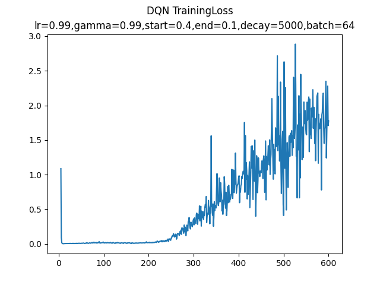

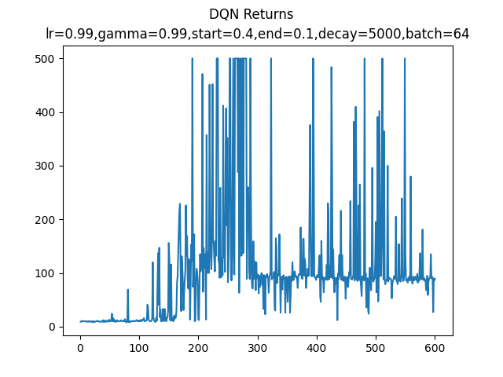

而下面两张图则是按照同样的超参数组合得到的DDQN算法结果图：
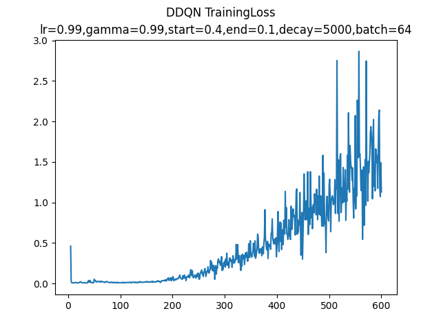

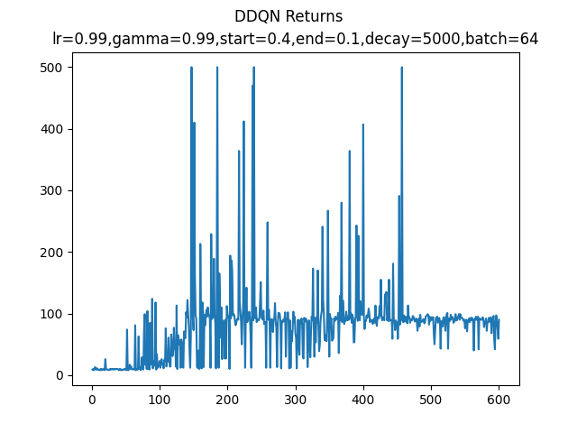

相比之下可以发现DDQN算法的性能确实高于DQN算法，因为对于回报，随着回合数的增加，对于相同的超参数组合，DDQN的Training Loss相比与DQN来说会稳定上升，DDQN的Returns回报也会比DQN稳定很多，从而可以得出结论，DDQN的算法性能确实会略优于DQN算法


