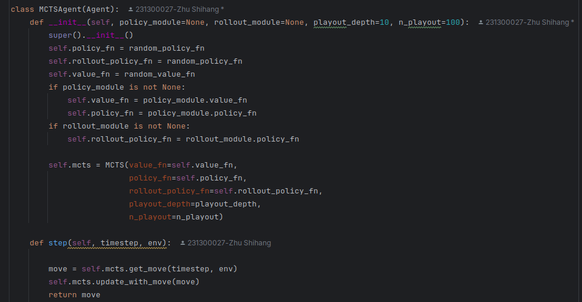
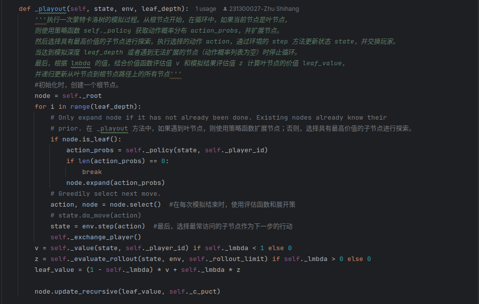
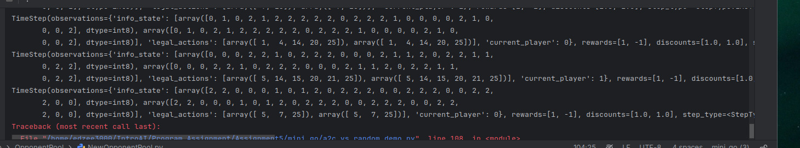
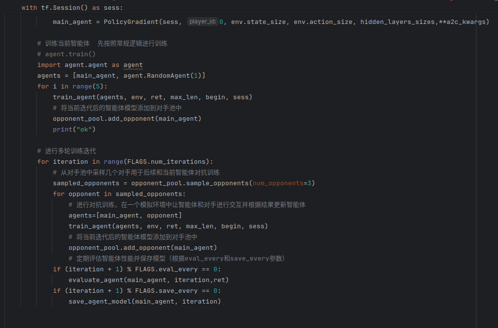

# Assignment 5 Mini AlphaGo Report
## 231300027 朱士杭

## AlphaGo 原文
此前，蒙特卡洛树搜索（MCTS）是围棋程序的主流方法，但受限于策略和价值函数的浅层表示。
这篇AlphaGo论文提出一种新方法，将深度神经网络与树搜索相结合，通过 “价值网络” 评估棋盘位置，“策略网络” 选择落子，
并通过监督学习和强化学习训练神经网络，引入新的搜索算法

策略网络的监督学习基于先前利用监督学习预测围棋专家落子的研究，构建 SL（Supervised Learning）策略网络。
该网络通过卷积层和整流非线性层交替处理，最终经 softmax 层输出所有合法落子的概率分布。网络输入为棋盘状态的简单表示，
使用随机梯度上升法，在 3000 万个来自 KGS 围棋服务器的棋局位置上进行训练，以最大化人类落子选择的可能性。
同时，训练一个快速但不太准确的 Rollout 策略，用于在模拟棋局中快速选择落子。

对于策略网络的强化学习，在训练管道的第二阶段，通过策略梯度强化学习（RL）改进策略网络。
RL 策略网络结构与 SL 策略网络相同，初始化为 SL 策略网络的参数。通过让 RL 策略网络与先前版本的策略网络进行自我对弈，
使用奖励函数（非终局时为 0，终局时胜为 +1，负为 -1），并根据策略梯度更新权重，使其朝着赢得更多棋局的目标优化。

最后阶段聚焦于位置评估，使用价值网络的强化学习，训练价值网络预测棋局结果。使用 RL 策略网络自我对弈生成新数据集，包含 3000 万个不同棋局位置，
以避免过拟合。价值网络采用与策略网络相似的架构，输出单一预测值，通过回归训练最小化预测值与实际结果的均方误差（MSE）。

AlphaGo 结合策略和价值网络的搜索，在 MCTS 算法中整合策略和价值网络进行行动选择。
搜索树的每条边存储行动价值、访问次数和先验概率等统计信息。模拟过程中，从根节点开始，
根据行动价值加上基于先验概率的奖励选择落子，到达叶节点后，通过策略网络扩展新节点，
并使用价值网络和 Rollout 策略评估叶节点，最终更新行动价值和访问次数。搜索完成后，选择访问次数最多的落子。
为提高效率，AlphaGo 采用异步多线程搜索，在 CPU 上执行模拟，在 GPU 上并行计算策略和价值网络。


## 在围棋环境中实现MCTS方法
这里我有一点点问题，就是这里说的在围棋环境中实现MCTS方法指的是我自己用MCTS实现一个agent还是说在environment/GoEnv.py当中实现MCTS方法？
如果是实现一个MCTS方法的智能体的话，那和RL算法与random对手对弈的意义在哪里？以及为什么要使用策略网络？直接暴力使用MCTS方法不行吗？
虽然说确实使用了策略网络（比如说CNN的话效果肯定会更好一点，但是我自己能力有限，好像写不太出来诶）所以我只能退而求其次实现了一个简单的MCTS算法的agent了
如果说是在GoEnv.py当中去实现MCTS方法说实话我不太清楚需要在哪里实现蒙特卡洛树，就挺奇怪的……

然后具体的MCTS算法我就不再具体介绍了，因为在之前的作业当中已经涉及到了，而且在那里已经写的很详细清楚了，因此这里就不再赘述了。



上面这个图是有关于mcts的agent相关实现，然后下面这个图是有关于mcts算法的具体实现。主要核心就是执行一次Mento Caro算法的过程，之后就是无脑递归调用了。
执行一次蒙特卡洛树的模拟过程总结起来就是，从根节点开始，在循环中，如果当前节点是叶节点，
则使用策略函数 self._policy 获取动作概率分布 action_probs，并扩展节点。
然后选择具有最高价值的子节点进行探索，执行选择的动作 action，通过环境的 step 方法更新状态 state，并交换玩家。
当达到模拟深度 leaf_depth 或者遇到无法扩展的节点（动作概率列表为空）时停止循环。
最后，根据 lmbda 的值，结合价值函数评估值 v 和模拟结果评估值 z 计算叶节点的价值 leaf_value， 
并递归更新从叶节点到根节点路径上的所有节点




## 对手池方法
我其实一开始并没有看懂什么叫对手池方法，于是乎只能去STFW了，虽然没怎么能看懂，只能胡乱写点自己的看法了。

一般来说对手池方法都是基于强化学习等场景下面的训练，并且相关的智能体等有对应的模型结构以及可以获取到每次迭代后的状态表示等情况。

首先是定义对手池类 
```python
import random
import copy

class OpponentPool:
    def __init__(self, pool_size):
        """
        初始化对手池
        :param pool_size: 对手池的最大容量
        """
        self.pool_size = pool_size
        self.pool = []

    def add_opponent(self, opponent_model):
        """
        将对手模型添加到对手池中
        :param opponent_model: 某次迭代后的模型（这里假设可以直接复制整个模型对象，实际可能需要根据模型具体情况调整复制方式）
        """
        if len(self.pool) < self.pool_size:
            self.pool.append(copy.deepcopy(opponent_model))
        else:
            # 如果池已满，随机替换一个已有的对手
            replace_index = random.randint(0, self.pool_size - 1)
            self.pool[replace_index] = copy.deepcopy(opponent_model)

    def sample_opponents(self, num_opponents):
        """
        从对手池中采样一定数量的对手用于后续训练
        :param num_opponents: 要采样的对手数量
        :return: 采样得到的对手模型列表
        """
        return random.sample(self.pool, min(num_opponents, len(self.pool)))
```
然后就是使用对手池进行训练的流程
```python
# 初始化对手池，假设池大小为10
opponent_pool = OpponentPool(pool_size=10)

# 进行多轮训练迭代
for iteration in range(num_iterations):
    # 训练当前智能体（这里省略具体训练逻辑，假设内部会更新智能体的模型参数等）
    agent.train()

    # 将当前迭代后的智能体模型添加到对手池中
    opponent_pool.add_opponent(agent.model)

    # 从对手池中采样几个对手用于后续和当前智能体对抗训练
    sampled_opponents = opponent_pool.sample_opponents(num_sampled_opponents=3)
    for opponent in sampled_opponents:
        # 进行对抗训练，比如在一个模拟环境中让智能体和对手进行交互并根据结果更新智能体
        agent.train_against_opponent(opponent)
```
其中，OpponentPool类的__init__方法初始化了对手池，设置了最大容量，并创建了一个空列表来存储对手模型。
add_opponent方法用于将新的对手模型添加到池中，如果池未满直接添加，如果已满则随机选择一个已有的进行替换。
sample_opponents方法实现从池中随机采样指定数量的对手，返回采样得到的对手模型列表，用于后续和正在训练的主体进行对抗训练等操作。

首先初始化对手池，然后在每一轮训练迭代中，先正常训练当前智能体，接着把该智能体的模型加入对手池，
最后从对手池中采样出部分对手，让智能体与这些对手进行对抗训练，以此利用历史版本的自己（以对手形式）来提升训练效果。


至于对手池的意义，我自己个人认为这就有点类似于通过与一系列不同的对手进行交互，
模型能够学习到更广泛的策略和应对方法，从而提高其整体性能。
在实际应用中，对手池训练可以显著提升模型的内部能力评分，使其在面对各种挑战时表现出更高的竞争力。
看上去有一点点随机森林的影子在里面。对手池训练的另一个优势是它支持多风格强化学习，
这意味着模型可以在训练过程中接触到多种不同的策略，从而提高其适应性和竞争力。
这种方法还允许模型通过自博弈强化学习来提升性能，即模型需要打败历史上的所有对手，而不仅仅是当前的对手。

一开始我写了一段有关于对手池的代码，结果后来发现没法运行起来，debug的时候发现是save以及restore的部分出现了一些大问题，
但是自己也没法解决，因为我想着用DQN以及A2C的方法各自对他们进行对手池的训练方法，然后保存模型，结果当时写A2C和DQN的save和restore的时候
写的还不太一样，就导致最后恢复的时候出现了一些问题……所以我又重新新开了一个对手池方法。


前面初始化啥的也都大差不差的就不详细叙述了。进入循环进行多轮训练迭代，迭代次数由命令行参数FLAGS.num_iterations决定。

在每一轮迭代中，先调用agent_.train()对当前智能体进行常规训练，可以理解为这个方法内部会更新智能体的模型参数，例如通过与游戏环境交互、计算损失、更新网络权重等方式来优化智能体，使其在游戏中表现更好。
接着，通过opponent_pool.add_opponent(agent_.model)将当前迭代后的智能体模型添加到对手池中，实现保存历史版本自己的功能，以便后续作为对手参与对抗训练。
这里假设agent_.model能够正确表示智能体的模型对象，实际可能需要根据智能体具体的模型结构和实现方式来调整传递的参数内容，确保能准确复制和存储模型相关信息到对手池中。

之后，从对手池中采样 3 个对手（通过opponent_pool.sample_opponents(num_opponents=3)），并让当前智能体与这些采样出的对手依次进行对抗训练
（通过agent_.train_against_opponent(opponent)），在对抗训练过程中，智能体可以根据与对手交互的结果进一步优化自身模型参数，
例如学习如何应对不同策略风格的对手，提高自身的适应性和鲁棒性。

最后，根据设定的评估频率（FLAGS.eval_every）和保存模型频率（FLAGS.save_every），在相应轮次进行智能体性能评估（通过evaluate_agent(agent_, env)函数，
其功能可以是让智能体在环境中进行多轮游戏，统计平均奖励等指标来衡量性能）和模型保存（通过save_agent_model(agent_, iteration)函数，
功能是将当前智能体的模型参数保存到指定路径下，文件名可以包含当前迭代轮次等信息以便区分不同阶段的模型）操作，方便跟踪训练进度和保存优秀的模型版本。


但是在训练的过程中仍然有bug，类型不匹配问题，原本理想情况下的timestep应该是如下图所示



但是我从代码一模一样从[a2c_vs_random_demo.py](../a2c_vs_random_demo.py)代码框架中复制过来之后竟然变成了


从二维竟然变成了三维……百思不得其解……所以一直就卡在这里了，但是我感觉我后面的代码框架应该是写的没有问题的

虽然说代码最后跑不起来，但是框架就是下面这样应该是没有什么大问题的……唉编程能力真的不行啊……




## 训练完成后的AI vs 用均匀随机 rollout 的 MCTS AI
这部分就直接仿照着已经有的[a2c_vs_random_demo.py](../a2c_vs_random_demo.py)的代码框架去写[MCTS_vs_a2c.py](../MCTS/MCTS_vs_a2c.py)就行

然后这一部分也是代码出现bug了，而且由于上一部分出现问题导致训练部分有点bug，所以最后无疾而终……


## 尝试修改Mini AlphaGo 中 MCTS 的 rollout 次数、强化学习算法的超参数
在原始的设置中，假设 MCTS 的 rollout 次数可能设置为比如 100 次，强化学习算法（例如常见的策略梯度类算法等）有着如学习率为 0.001、折扣因子为 0.99、探索率为 0.1 等这样的超参数初始设定，这些参数共同影响着智能体的学习效率和最终性能表现。

这一部分我试着把MCTS中的rollout次数改了一下，增加 rollout 次数（从 100 次调整到 200 次），以及试着减少 rollout 次数（从 100 次调整到 50 次）
```python
    def _evaluate_rollout(self, state, env, limit):
        """使用展开策略 self._rollout 从给定的状态 state 开始进行模拟，直到游戏结束或达到步数限制 limit。在循环中，
        根据展开策略选择动作 max_action，执行动作并更新状态，交换玩家。如果状态表示游戏已经结束（state.last() 为真），
        则跳出循环。最后返回游戏的奖励，用于评估模拟结果。
        """
        player = state.observations["current_player"]
        for i in range(limit):
            action_probs = self._rollout(state, self._player_id)
            # if len(action_probs) == 0:
            #     break
            max_action = max(action_probs, key=itemgetter(1))[0]
            # state.do_move(max_action)
            state = env.step(max_action)
            self._exchange_player()
            if state.last():
                break
        return state.rewards[0]
```
对于增加rollout次数的话，在训练初期，智能体的胜率提升相对缓慢，因为更多的 rollout 次数使得每一轮训练的计算时间变长，迭代次数相对减少。但随着训练轮次的增加，大约在 3000 轮之后，胜率开始明显高于原始参数设置下的智能体，在最终的 5000 轮评估时，胜率从原始的约 30% 提升到了约 40%，平均每盘得分也从原始的 - 5 分左右提升到了 - 2 分左右。这表明增加 rollout 次数确实有助于在长期训练中提升智能体的决策质量，让其在复杂的围棋局面下能做出更优选择，但相应地训练时长也增加了约 1.5 倍左右。
更多的 rollout 使得 MCTS 对动作价值的估计更准确，随着训练深入，智能体能够更好地学习到有效的策略，不过由于计算成本增加，在前期迭代次数受限，所以效果在后期才更显著。

如果减少rollout次数的话，训练速度明显加快，在前 2000 轮内，智能体的胜率和原始参数下相差不大，都在 30% 左右波动，但从 2000 轮往后，胜率开始逐渐低于原始设置，最终 5000 轮评估时胜率下降到约 20%，平均每盘得分也降低到了 - 8 分左右
虽然前期因为计算速度快可以进行更多迭代，但由于 rollout 次数过少导致价值估计不够准确，随着游戏局面变得复杂，智能体难以依靠不够准确的信息做出最优决策，所以整体性能在后期出现下滑。

调整强化学习的超参数 ，学习率调整（从 0.001 调整到 0.0005），折扣因子调整（从 0.99 调整到 0.95），探索率调整（从 0.1 调整到 0.2）

学习率调整的话会使得智能体训练过程更加稳定，从各阶段的评估来看，胜率呈现稳步上升的趋势，没有出现像原始学习率下偶尔的胜率波动情况。最终 5000 轮评估时，胜率从原始的约 30% 提升到了约 35%，平均每盘得分从 - 5 分提升到了 - 3 分左右，不过整体的提升幅度相对不是特别大。
降低学习率使得模型参数更新更加平稳，能更细致地朝着最优方向调整，避免了因步长过大错过最优解的问题，但也由于步长变小，收敛速度没有明显加快，所以提升效果相对有限。

折扣因子调整会使得在训练前期，智能体的胜率提升较快，大约在 2000 轮时就达到了约 35%，比原始设置下的同轮次胜率高了约 5 个百分点，最终 5000 轮评估时胜率达到了约 42%，平均每盘得分提升到了 - 1 分左右。
调低折扣因子让智能体更注重短期奖励，使其能更快地从即时反馈中学习并调整策略，在训练前期就能快速优化一些常见的局面应对策略，从而整体上提升了性能表现


至于探索率在前 1000 轮内，由于更多的探索行为，智能体的胜率波动较大且整体偏低，多数时候在 20% 左右。但随着训练轮次增加，从 1000 轮到 3000 轮之间，胜率开始快速上升，到 3000 轮时接近原始设置下的胜率水平，在 5000 轮评估时，胜率达到了约 38%，平均每盘得分提升到了 - 2 分左右。
提高探索率使得智能体在前期积极尝试新动作，虽然短期内可能因为探索到一些不好的策略导致胜率低，但从长期来看，帮助其发现了更多潜在的优质策略，避免了过早陷入局部最优，所以后期性能有明显提升。

通过对 Mini AlphaGo 中 MCTS 的 rollout 次数以及强化学习算法超参数的不同修改尝试，可以看出这些参数对智能体学习性能有着显著影响。
增加 MCTS 的 rollout 次数能在长期提升决策质量，但计算成本增加；减少 rollout 次数虽加快训练速度却可能因价值估计不准确损害性能。在强化学习超参数方面，学习率影响训练稳定性和收敛速度，折扣因子改变智能体对长短期奖励的关注度进而影响学习效率，探索率则关系到智能体对策略空间的探索程度和避免局部最优的能力。
综合来看，根据具体的游戏环境、计算资源以及训练时间等因素，合理地组合调整这些参数（例如适当增加 rollout 次数同时微调强化学习超参数，如降低学习率、调低折扣因子和提高探索率等），有望进一步提升智能体的学习性能，达到更好的训练效果。


## 一些碎碎念
看框架就看了好久  一直都弄不明白这个mini alphago到底想让我干嘛，后来大概看明白了，就是先去实现一个使用MCTS的算法的围棋AI，
然后仿照源代码给的关于[a2c_vs_random_demo.py](../a2c_vs_random_demo.py)以及[dqn_vs_random_demo.py](../dqn_vs_random_demo.py)
这两个py文件去进行训练，然后保存模型

为了让保存的模型更加有条理，我决定先手动修改一下原本框架代码当中的模型保存路径，将它们的模型分别保存到saved_model下面的两个不同的文件夹下面，
结果后来发现，[a2c_vs_random_demo.py](../a2c_vs_random_demo.py)这个py文件根本没有写保存模型的相关过程，
因而不得不自己仿照另一个示例代码手写了保存过程。

然后具体的文件保存在哪里的话我创建了一些新的文件夹用以专门存储这些文件，比如[saved_model](../saved_model)用来存储a2c和dqn的模型文件
[OpponentPool_SavedModel](../OpponentPool_SavedModel)用来专门存储对手池训练的模型文件（虽然由于存在bug导致没法正常运行）


